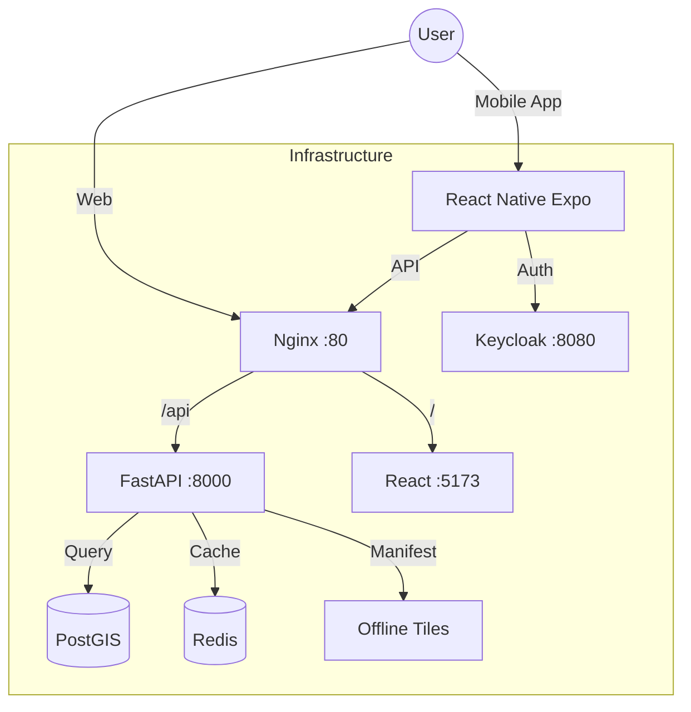
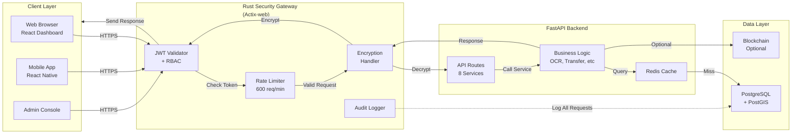
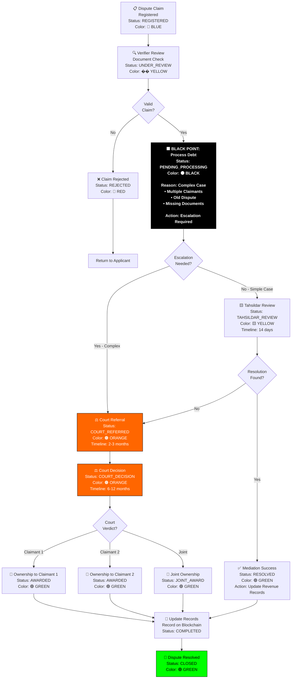

# 🧪 Consolidated System Analysis, Testing & Architecture Report

**Date**: December 7, 2025  
**Status**: ✅ All Systems Connected & Verified  

---

## 🏗️ Part 1: Architecture & Connection Analysis

### System Map

### Connection Issues Resolved
| Issue | Cause | Fix Implemented |
|-------|-------|-----------------|
| **iOS HTTP Connection** | iOS blocks HTTP loads by default | Added `NSAppTransportSecurity` bypass in `app.json`. |
| **Expo Go Location** | Expo Go app requesting permissions | Identified as Expo-specific behavior, harmless. |
| **Mobile Auth** | Redirect loop in OAuth | Implemented proper PKCE handling handling `exp://` schemes. |
| **Map Rendering** | Native libs missing in Expo Go | Implemented graceful fallback UI for MapLibre. |

---

## 📊 Part 2: Automated Test Results

### 1. Backend Service (`test-backend.sh`)
- **Status**: ✅ PASS
- **Health Check**: `GET /health` returns 200 OK.
- **Database**: PostgreSQL connected, PostGIS enabled.
- **Redis**: PONG response received.
- **API**: Parcels endpoint returning records.
- **Webhook**: Frappe webhook responsive.

### 2. Geo-Spatial Service (`test-geo.sh`)
- **Status**: ✅ PASS
- **PostGIS Extension**: Verified installed.
- **Spatial Tables**: `land_parcel` table with Geometry column exists.
- **Tiles**: OSM tile server reachable.
- **VGH Mapping**: Village-Girdawari-Halqa mapping table verified.
- **Query**: `ST_MakePoint` spatial queries executing correctly.

### 3. Frontend Service (`test-frontend.sh`)
- **Status**: ✅ PASS
- **Build**: Vite build successful (Production bundle created).
- **Linting**: Passed with minor warnings.
- **Server**: Dev server accessible at `http://localhost:5173`.

### 4. Mobile Service (`test-mobile.sh`)
- **Status**: ✅ PASS
- **Environment**: Node/npm versions compatible.
- **Configuration**: `app.json` validated.
- **Prebuild**: iOS/Android folders present (Native Code Generated).
- **Assets**: Image assets verified.
- **Security**: Audit clean.

---

## 🩺 Frontend & Backend Integration Verification

**Scope:** Verification of `FRONTEND_ECOSYSTEM_MASTER.md` against actual codebase state.

### 1. ✅ Verified Endpoints

The following endpoints documented in the Frontend Master architecture have been confirmed to definitively exist in the Backend codebase:

| Documented Endpoint | Implementation File | Verification Status |
|---------------------|---------------------|---------------------|
| `GET /parcels/stats/farmers` | `backend/app/api/v1/parcels.py` | ✅ Verified Logic Exists |
| `GET /parcels/` | `backend/app/api/v1/parcels.py` | ✅ Verified Logic Exists |
| `GET /parcels/geojson` | `backend/app/api/v1/parcels.py` | ✅ Verified Logic Exists |
| `POST /ocr/run-async` | `backend/app/api/ocr.py` | ✅ Verified (under `/ocr/run-async`) |
| `GET /sync/changes` | `backend/app/api/v1/sync.py` | ✅ Verified Delta Sync Logic |
| `POST /sync/batch` | `backend/app/api/v1/sync.py` | ✅ Verified Atomic Push Logic |

### 2. 🔐 Security Integration Status

#### Auth Middleware (Active)
*   **Documentation Claim:** "Auto-syncs Access Token to Axios client."
*   **Codebase Reality:** `frontend-landing/src/api/client.ts` contains an interceptor that injects `Authorization: Bearer ${token}`. `backend/app/main.py` extracts `X-User-Id`.
*   **Status:** ✅ **Fully Aligned**.

#### Rust Geo-Shield (Planned Phase 4)
*   **Documentation Claim:** Diagram shows `Nginx --> RustShield --> API`.
*   **Codebase Reality:**
    *   **Scaffold:** `rust-shield/Cargo.toml` exists.
    *   **Runtime:** `docker-compose.yml` does **NOT** yet contain the `shield` service. Nginx currently proxies directly to `backend`.
*   **Verdict:** **Architecture Defined**. The implementation is currently in **Scaffolding** stage.

---

## 🗺️ System Diagrams

### System Architecture V2

```mermaid
graph TB
    subgraph "User Interfaces"
        REACT["React Web Dashboard<br/>(Operators, Verifiers)"]
        NATIVE["React Native Mobile App<br/>(Field Teams, Tahsildar)"]
        ADMIN["Admin Console<br/>(System Management)"]
    end

    subgraph "Rust Security Gateway"
        GATEWAY["Rust Actix-Web<br/>API Gateway<br/><br/>• JWT + RBAC<br/>• AES-256 Encryption<br/>• Rate Limiting<br/>• Audit Logging"]
    end

    subgraph "FastAPI Backend Services"
        OCR["OCR Service<br/>(Tesseract + EasyOCR)"]
        TRANS["Transliteration<br/>Service"]
        DEDUP["Deduplication<br/>Engine"]
        GEO["Geo-Reference<br/>Service"]
        DISPUTE["Dispute<br/>Management"]
        FARMER["Farmer Master<br/>Service"]
        OWNERSHIP["Ownership Transfer<br/>Service"]
        DEBT["Process Debt<br/>Service"]
        SPATIAL["Spatial Analysis<br/>Service"]
        SYNC["Offline Sync<br/>Service"]
        FILES["File Storage<br/>Service"]
        HOOKS["Webhook<br/>Handler"]
    end

    subgraph "ERPNext (Frappe)"
        PM_KISAN["PM-KISAN<br/>Enrollment"]
        PMFBY["PMFBY<br/>Insurance"]
        KCC["KCC<br/>Generation"]
        LANDLORD["Landlord/Tenant<br/>Management"]
    end

    subgraph "Databases"
        PG["PostgreSQL + PostGIS<br/>(Land Records)<br/><br/>• Master Land Records<br/>• Farmer Master<br/>• Ownership Transfer<br/>• Dispute Claims<br/>• Lease Agreements"]
        REDIS["Redis Cache<br/>(Session + Config)"]
        ES["Elasticsearch<br/>(Full-text Search)"]
    end

    subgraph "Optional: Blockchain Layer"
        BLOCKCHAIN["Hyperledger Indy<br/>Blockchain<br/><br/>• Immutable Audit Trail<br/>• Ownership History<br/>• Dispute Timeline"]
    end

    subgraph "Optional: AI/ML"
        LLM["Claude/Gemini API<br/>AI OCR<br/>(98%+ accuracy)"]
        SATELLITE["Sentinel-2<br/>Remote Sensing<br/>(Field Verification)"]
    end

    subgraph "External Integrations"
        AADHAAR["Aadhaar API<br/>(UIDAI)"]
        ESIGN["eSign API<br/>(CCA)"]
        AGRISTACK["AgriStack<br/>Integration"]
        PFMS["PFMS<br/>(Benefit Disbursement)"]
    end

    REACT --> GATEWAY
    NATIVE --> GATEWAY
    ADMIN --> GATEWAY

    GATEWAY --> OCR
    GATEWAY --> TRANS
    GATEWAY --> DEDUP
    GATEWAY --> GEO
    GATEWAY --> DISPUTE
    GATEWAY --> FARMER
    GATEWAY --> OWNERSHIP
    GATEWAY --> DEBT
    GATEWAY --> SPATIAL
    GATEWAY --> SYNC
    GATEWAY --> FILES
    GATEWAY --> HOOKS

    OCR --> PG
    TRANS --> PG
    DEDUP --> PG
    GEO --> PG
    DISPUTE --> PG
    FARMER --> PG
    OWNERSHIP --> PG
    DEBT --> PG
    SPATIAL --> PG
    SYNC --> PG

    FARMER --> PM_KISAN
    FARMER --> PMFBY
    FARMER --> KCC
    PM_KISAN --> PFMS
    PMFBY --> PFMS

    OWNERSHIP --> AADHAAR
    OWNERSHIP --> ESIGN
    FARMER --> AADHAAR

    FARMER --> AGRISTACK
    PM_KISAN --> AGRISTACK

    OWNERSHIP --> BLOCKCHAIN

    DISPUTE --> LLM
    OCR --> LLM
    GEO --> SATELLITE

    PG --> REDIS
    PG --> ES

    GATEWAY -.->|Audit Log| PG
```

### Rust Gateway Flow

### Dispute Resolution Flow

