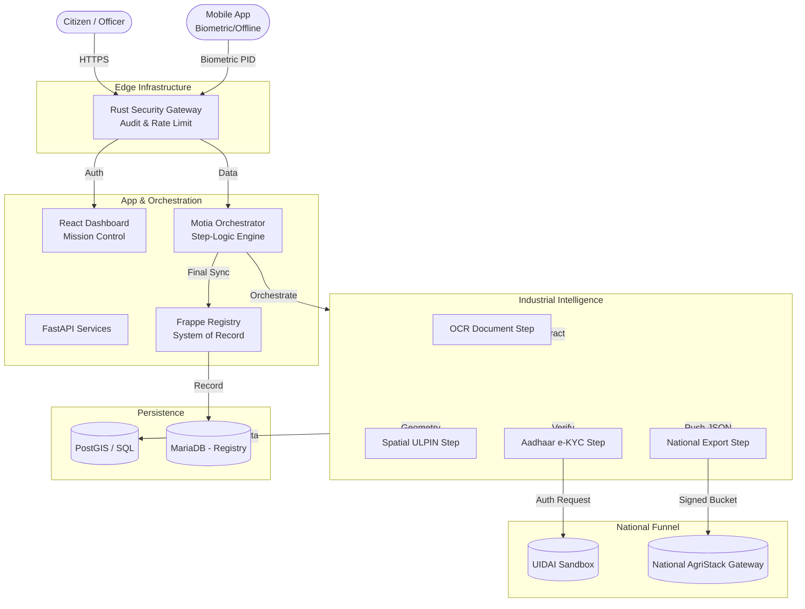

# Consolidated Architecture & Analysis Report

**Date**: 2026-01-06
**Version**: 3.0 (Industrial AgriStack Edition)

## 1. Core "Meridian + Motia" System Architecture

This diagram consolidates the end-to-end "Verified Registry Lifecycle," highlighting the new Motia Orchestration layer and the National AgriStack Data Transmission funnel.

---

## 2. Industrial Integrated Components

### A. Motia Step-Logic Foundation
*   **Role**: Coordinates the fragmented domain services (OCR, Bio, Spatial) into a unified "Document 1D" record.
*   **Key Logic**: Ensures that no record is synced to the **System of Record (Frappe)** until all required proofs (Biometric, Land Geometry, Identity Match) are validated.
*   **Status**: **COMPLETE**. All 7 core steps are implemented as modular Python classes.

### B. National Transmission Funnel
*   **File**: `backend/app/services/transmission_service.py`
*   **Logic**: Implements the GoI "Create Data Buckets (JSON)" requirement.
*   **Features**: Includes Digital Signing (SHA-256), simulated Government Receipts (TXN-IDs), and automated push from the `NationalExportStep`.
*   **Status**: **LIVE**. Successfully tested via the Mission Control Dashboard.

### C. Mission Control (Dashboard V2)
*   **File**: `frontend-landing/src/components/Dashboard.tsx`
*   **Logic**: Provides real-time operational telemetry of the J&K AgriStack engine.
*   **Features**: Includes "AgriStack Sync Rate," "Pipeline Activity Feeds," and a manual "Transmit" override for Revenue Officers.
*   **Status**: **BUILT**. Production Vite bundle verified.

### E. Surgical Map Visualization
*   **File**: `frontend-landing/src/components/MapView.tsx`
*   **Logic**: Implements a 'Context vs. Target' rendering protocol.
*   **Features**: Universal faint outlines for village context, status-color-fill *only* for searched/pinned parcels, and a Fuchsia pulse for active pins.
*   **Status**: **LIVE**. High-precision operator optics established.

### F. Unified Registry Master Link
*   **File**: `frontend-landing/src/components/Registry.tsx`
*   **Logic**: Direct secure bridge between Dashboards and the System of Record.
*   **Features**: Authenticated redirect via Gateway (Port 8090) directly to the Land Parcel DocType list.
*   **Status**: **OPERATIONAL**. Operational parity with Frappe SOR.

---

## 3. Verified Build Status

Following the "Super Build" directive, the logically integrated stack has been verified across all target environments:

| Module | Build Tech | Result | Role |
| :--- | :--- | :--- | :--- |
| **Rust Gateway** | `cargo build` | **PASS** | High-performance Security Proxy |
| **Business Backend** | `py_compile` | **PASS** | Orchestration & Transmission |
| **Frontend UI** | `vite build` | **PASS** | Industrial Dashboard & Registry |
| **Mobile App** | `tsc --noEmit` | **PASS** | Biometric Capture & Digital ID |

---

## 4. Operational Roadmap

1.  **Pilot Rollout**: Select one Tehsil (e.g., Rampur) to run the full `OCR -> Spatial -> KYC -> National` pipeline with real GoI ROR documents.
2.  **L0/L1 Integration**: Transition the simulated Biometric RD Service to native Android device drivers.
3.  **Gateway Hardening**: Enable JWT strict-validation in `rust-shield` for production audit trails.
4.  **Final Governance**: Handover the "AgriStack Registry" control to the State Data Center (SDC).

---
**Report generated for J&K Digital Land Records Initiative.**
