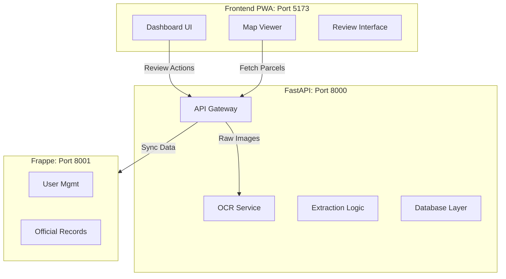

# 🖥️ Desktop vs. Backend Inventory & Cleanup Report

This document outlines the component separation and clean-up strategy for the **Desktop Application** (Frontend PWA) vs. the Backend.

## 1. Things to REMOVE for Desktop Application
The Desktop Application (`/frontend`) is intended for **Office Administration** (Patwaris/Tehsildars at desks). The following "Field/Mobile" features currently present in the code should be **removed or disabled** in the Desktop build to keep it lightweight and focused.

| Component / Feature | Why Remove? |
| :--- | :--- |
| **`CameraCapture.tsx`** | Desktop users upload scanned files, they don't use a device camera to capture document photos live. |
| **`TesseractOCR.ts` (Client-side)** | Desktop has reliable internet; OCR should always run on the **Backend** (Server-side) for higher accuracy, not in the browser. |
| **`QueueManager.tsx` (Offline Sync)** | Complex offline sync logic is for field devices with spotty connection. Desktop apps can assume connectivity and save directly. |
| **`CaptureQueue.ts`** | Related to the above; queuing captured images is a mobile workflow. |
| **"Sign in with SSO" (Mobile Flow)** |  If the desktop app is strictly intranet, it might integrated differently than the Mobile OIDC flow (though OIDC is generally good to keep). |

---

## 2. Component Inventory

### 🅰️ Front-End (`/frontend`)
**Role**: Admin Dashboard, Map Visualization, Data Review.

#### **Core Components**
- **`Dashboard.tsx`**: High-level stats (Total Parcels, Pending Reviews).
- **`MapViewer.tsx`**: The central "Google Earth" style interface for viewing Land Parcels.
- **`ReviewQueue.tsx`**: The "Human-in-the-Loop" interface for correcting OCR mistakes.
- **`Sidebar.tsx`**: Navigation.
- **`Header.tsx`**: User profile and system status.

#### **Features (To Refine)**
- **`features/extraction/forms`**: Forms for manually editing/fixing Land Records (Girdawari/Khasra).
- **`features/transliteration`**: Tools to convert Urdu text to English for searching.
- **`api/client.ts`**: The bridge that calls the Backend APIs.

---

### 🅱️ Back-End (`/backend`)
**Role**: Heavy Lifting, Data Processing, Database Management.

#### **API Modules (`/api/v1`)**
- **`ocr.py`**: Receives images -> Returns raw text (Google Vision / Tesseract Wrapper).
- **`parcels.py`**: CRUD operations for Land Parcels (Spatial data).
- **`reviews.py`**: Endpoints for the Review Queue (fetching pending tasks, submitting corrections).
- **`frappe_sync.py`** & **`webhooks.py`**: Connectors that sync data to the **Frappe/ERPNext** system on port 8001.
- **`geo.py`**: Tile server logic for serving map data.

#### **Services (`/services`)**
- **`extraction/`**: Regex logic (`FIELD_EXTRACTION.md`) to parse raw text into fields (Name, Khasra No, Area).
- **`normalization/`**: Cleaning up dirty data types (e.g., converting "10 Kanal" to number `10.0`).
- **`storage/`**: Saving original scanned images (MinIO/S3).
- **`validation/`**: ensuring data integrity rules (e.g., Total Area cannot be negative).

---

## 3. Architecture Summary

