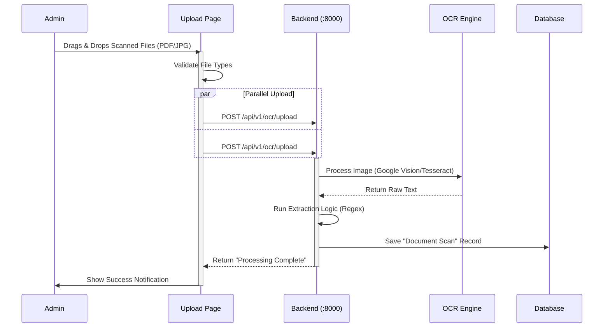
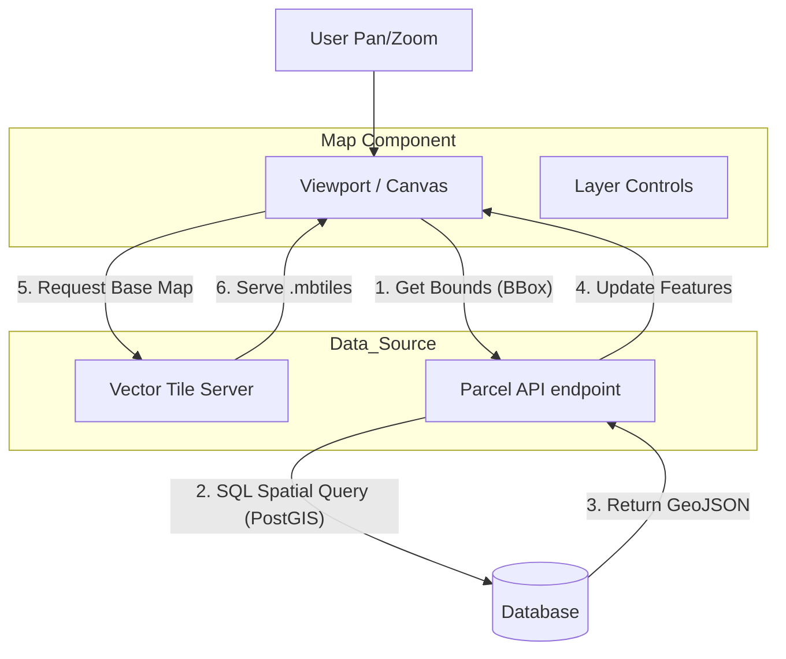
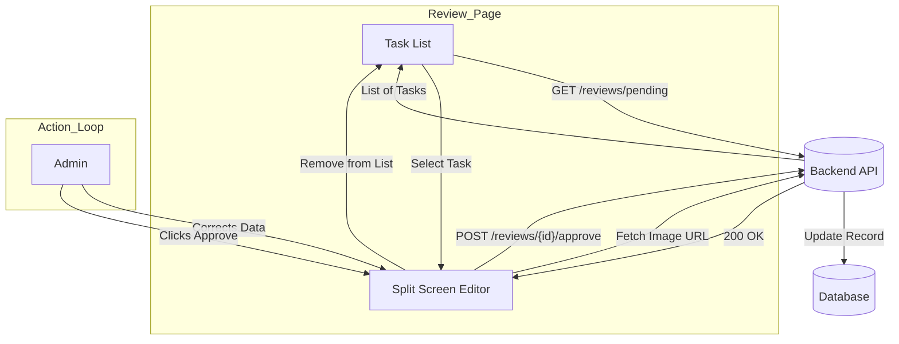

# 🌐 &nbsp;Frontend Web Application Architecture (React + Tailwind)

This document visualizes the architecture of the **Land Records Desktop Web Application**. This model shifts away from complex "Offline PWA" behaviors (like syncing and on-device machine learning) towards a standard, robust **React + Tailwind** website model that communicates directly with the backend.

---

## 1. 📊 Dashboard Module

**Purpose**: The Command Center. It provides high-level metrics and quick actions for the administrator.

**Website Model Logic**:
- Fetches aggregated data directly from the Backend API on load.
- No local caching or complex sync required.

```mermaid
graph LR
    subgraph Client [React Web App]
        D_UI[Dashboard UI]
        Stats_Comp[Stats Component]
    end

    subgraph Server [Backend API :8000]
        API_Stats[/api/v1/stats]
        DB[(PostgreSQL)]
    end

    D_UI -- 1. Mounts --> Stats_Comp
    Stats_Comp -- 2. GET /stats --> API_Stats
    API_Stats -- 3. Query Aggregates --> DB
    DB -- 4. Return Counts --> API_Stats
    API_Stats -- 5. JSON Data --> Stats_Comp
    Stats_Comp -- 6. Render Charts --> D_UI
```

---

## 2. 📤 Upload & Capture Module

**Purpose**: In the Web Model, "Capture" effectively means **File Upload**. Administrators scan physical documents in bulk and upload PDF/Images to the system.

**Changes from Mobile PWA**:
- **Removed**: Live Camera Interface, Offline Queue.
- **Added**: Drag-and-Drop Zone, Batch Upload progress bar.



---

## 3. 🗺️ Map View Module

**Purpose**: A GIS-like interface to view digitized Land Parcels overlaid on satellite or vector maps.

**Website Model Logic**:
- Uses **MapLibre GL JS** to render vector tiles.
- Fetches GeoJSON data for parcels based on the visible viewport (BBox fetching).



---

## 4. 📝 Review Queue Module

**Purpose**: The "Human-in-the-Loop" correction station. When OCR confidence is low, tasks appear here for manual verification.

**Website Model Logic**:
- Split-screen UI: Original Image on Left, Form Fields on Right.
- Direct "Approve/Reject" API calls.



---

## 5. 🗄️ Registry Module

**Purpose**: The CRUD (Create, Read, Update, Delete) interface for the official Land Records (The "Ledger").

**Website Model Logic**:
- Standard Data Table with Pagination, Sorting, and Filtering.
- Edit Modals for record updates.

```mermaid
graph LR
    subgraph Registry_UI
        Table[Data Grid / Table]
        Filter[Search Bar]
        Edit[Edit Modal]
    end

    subgraph Backend
        Endpoint[/api/v1/parcels]
    end

    Filter -- "Debounced Search" --> Table
    Table -- "GET ?q=search_term&page=1" --> Endpoint
    Endpoint -- "Paginated Results" --> Table
    
    Table -- "Click Edit" --> Edit
    Edit -- "PUT /parcels/{id}" --> Endpoint
```

---

## 🏗️ Architecture Summary: "The Website Model"

Unlike the Mobile PWA, this model assumes **Constant Connectivity** and offloads all heavy processing to the server.

| Feature | Mobile/PWA Model (Deprecated for Desktop) | **Website Model (Adopted)** |
| :--- | :--- | :--- |
| **Logic** | Heavy Client-side (Offline sync, Local DB) | **Light Client-side** (API data fetching) |
| **OCR** | Tesseract.js (In-Browser) | **Server-side Pipeline** (Python/FastAPI) |
| **State** | Redux/Context + Persistence | **React Query** (Server State management) |
| **Upload** | Camera Capture Stream | **File Picker / Drag-and-Drop** |
