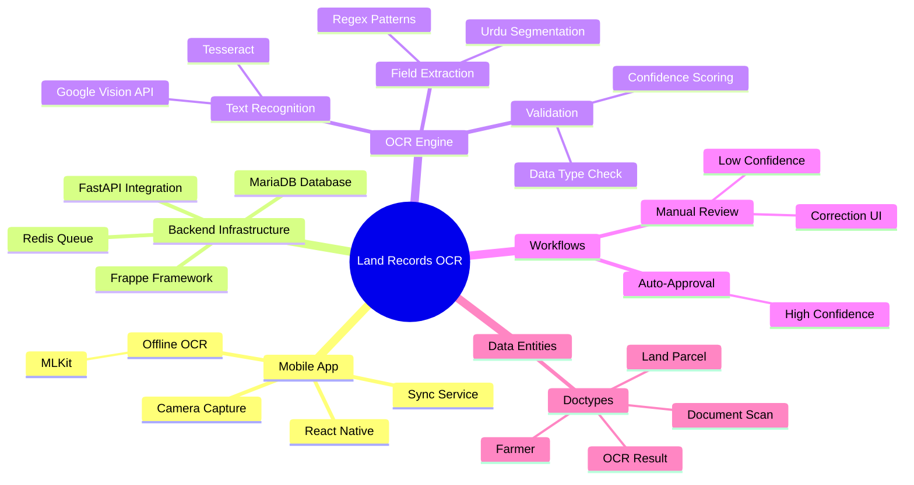
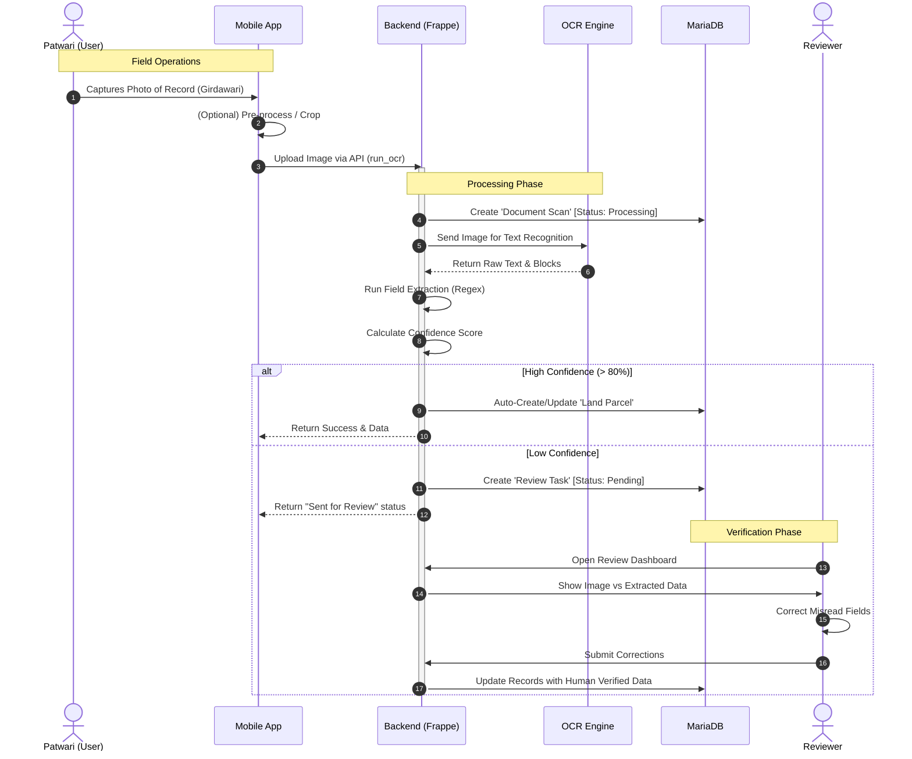
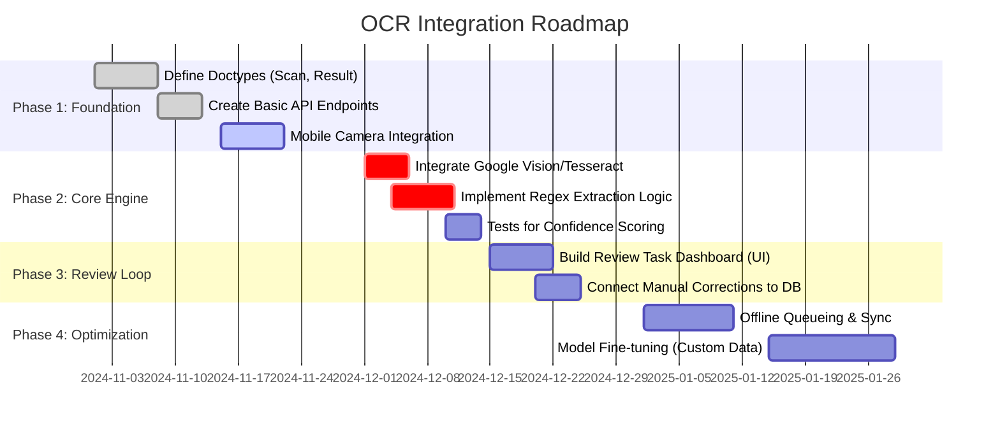

# OCR & Field Extraction Pipeline Architecture

This document outlines the architecture for the Optical Character Recognition (OCR) and Field Extraction pipeline used in the Land Records application. The system is designed to digitize Urdu land records (Girdawari, Khasra) via a hybrid mobile-cloud approachSystem.

## System Concept Map



## System Architecture

```mermaid
graph TD
    subgraph Mobile App [Mobile Application]
        A[Camera Capture] -->|Image| B{Connectivity?}
        B -->|Offline| C[On-Device OCR (MLKit)]
        B -->|Online| D[Upload to Backend]
        C -->|Raw Text| D
        C -->|Preview| E[User Verification]
    end

    subgraph Backend [Frappe + FastAPI Backend]
        D -->|API Request| F[Frappe API Endpoint: run_ocr]
        F --> G[Create Document Scan Record]
        G --> H{OCR Engine}
        H -->|Tesseract / Vision API| I[Raw Text Generation]
        
        subgraph Extraction Service [Field Extraction Engine]
            I --> J[Text Preprocessing]
            J --> K[Regex Pattern Matching]
            K -->|Extract| L[Key Fields]
            L -->|Validate| M[Confidence Scoring]
        end
        
        M --> N[Create OCR Result Record]
        N --> O{Confidence > Threshold?}
        O -->|Yes| P[Auto-Create/Update Records]
        O -->|No| Q[Create Review Task]
    end

    subgraph Database [MariaDB / Doctypes]
        P --> R[Farmer / Land Parcel]
        Q --> S[Review Task Queue]
        S -->|Manual Review| T[Human Operator]
        T -->|Correction| P
    end
```

## Component Breakdown

### 1. Mobile Capture & Pre-processing
- **Capture**: High-resolution image capture of land records.
- **On-Device OCR**: Utilizes `react-native-mlkit-ocr` for immediate feedback and offline capability.
- **Sync**: Uploads image and optionally local OCR results when connectivity is available.

### 2. Backend Processing (`frappe-backend`)
- **API Entry**: `run_ocr` endpoint handles incoming requests.
- **Document Management**: Tracks state via `Document Scan` doctype.
- **OCR Engine**: 
  - *Current*: Placeholder simulation / Tesseract integration.
  - *Target*: Google Cloud Vision API or fine-tuned Urdu OCR model.

### 3. Field Extraction Service
Implements logical analysis of OCR output based on patterns defined in `FIELD_EXTRACTION.md`.

#### Key Extraction Steps:
1.  **Segmentation**: Breaks text into lines/tokens.
2.  **Pattern Matching**: Applies Regex for specific fields (e.g., Khasra, Village).
    - *Example (Khasra)*: `r'(?:خسرہ|khasra|plot)[\s:]+(\d+(?:[/-]\d+)*)'`
3.  **Validation**: Checks data types (e.g., Area must be float).
4.  **Confidence Scoring**: Weighted score based on OCR confidence + Field presence.
    - `Score = (Field_match_rate * 0.6) + (OCR_confidence * 0.4)`

## Process Walkthrough

This sequence illustrates the end-to-end flow of a document being processed from the field to the database.



## Implementation Roadmap

The development is divided into four distinct phases to ensure stability and accuracy.



### Detailed Implementation Steps

#### Phase 1: Foundation (Completed/Active)
- **Schema Setup**: Created `Document Scan`, `OCR Result`, and `Review Task` Doctypes in Frappe.
- **API**: `run_ocr` endpoint is ready to receive requests (currently mocked).
- **Mobile**: Camera capture implementation in React Native.

#### Phase 2: Core Engine (Immediate Priority)
- **OCR Integration**: Replace the "Simulated OCR Text" in `api.py` with actual calls to Tesseract (local) or Google Cloud Vision (cloud).
- **Extraction**: Port the regex logic from `FIELD_EXTRACTION.md` into a Python service class `FieldExtractionService`.
- **Unit Testing**: robust tests matching sample Urdu documents against expected fields.

#### Phase 3: Review Loop
- **Frappe UI**: Create a custom Desk page or Form view for `Review Task` that shows the image side-by-side with the form fields.
- **Correction Logic**: Ensure that when a Reviewer saves the task, the target `Farmer` or `Land Parcel` record is actually updated.

#### Phase 4: Optimization
- **Queue Management**: Use Redis/Bull for processing large batches of images without blocking the API.
- **Offline**: Mobile app stores images locally and syncs when back online using the `sync_queue` logic.
