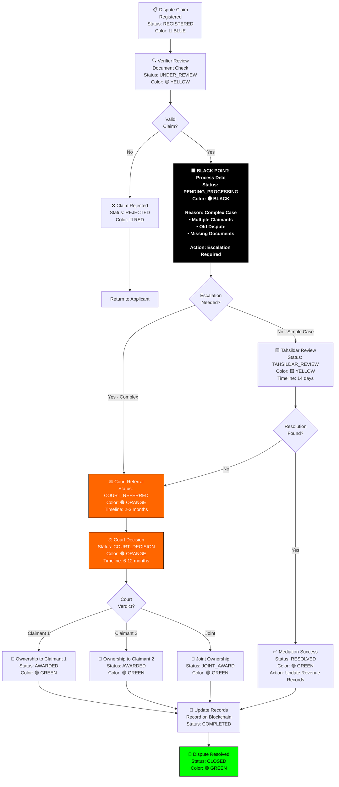

```mermaid
graph TD
    A["📋 Dispute Claim<br/>Registered<br/>Status: REGISTERED<br/>Color: 🔵 BLUE"]
    
    A --> B["🔍 Verifier Review<br/>Document Check<br/>Status: UNDER_REVIEW<br/>Color: 🟡 YELLOW"]
    
    B --> C{Valid<br/>Claim?}
    
    C -->|No| D["❌ Claim Rejected<br/>Status: REJECTED<br/>Color: 🔴 RED"]
    D --> E["Return to Applicant"]
    
    C -->|Yes| F["🟥 BLACK POINT: Process Debt<br/>Status: PENDING_PROCESSING<br/>Color: ⚫ BLACK<br/><br/>Reason: Complex Case<br/>• Multiple Claimants<br/>• Old Dispute<br/>• Missing Documents<br/><br/>Action: Escalation Required"]
    
    F --> G{Escalation<br/>Needed?}
    
    G -->|No - Simple Case| H["🟨 Tahsildar Review<br/>Status: TAHSILDAR_REVIEW<br/>Color: 🟨 YELLOW<br/>Timeline: 14 days"]
    
    G -->|Yes - Complex| I["⚖️ Court Referral<br/>Status: COURT_REFERRED<br/>Color: 🟠 ORANGE<br/>Timeline: 2-3 months"]
    
    H --> J{Resolution<br/>Found?}
    
    J -->|Yes| K["✅ Mediation Success<br/>Status: RESOLVED<br/>Color: 🟢 GREEN<br/>Action: Update Revenue Records"]
    
    J -->|No| I
    
    I --> L["⚖️ Court Decision<br/>Status: COURT_DECISION<br/>Color: 🟠 ORANGE<br/>Timeline: 6-12 months"]
    
    L --> M{Court<br/>Verdict?}
    
    M -->|Claimant 1| N["🎯 Ownership to Claimant 1<br/>Status: AWARDED<br/>Color: 🟢 GREEN"]
    
    M -->|Claimant 2| O["🎯 Ownership to Claimant 2<br/>Status: AWARDED<br/>Color: 🟢 GREEN"]
    
    M -->|Joint| P["🎯 Joint Ownership<br/>Status: JOINT_AWARD<br/>Color: 🟢 GREEN"]
    
    N --> Q["📝 Update Records<br/>Record on Blockchain<br/>Status: COMPLETED"]
    O --> Q
    P --> Q
    K --> Q
    
    Q --> R["🎉 Dispute Resolved<br/>Status: CLOSED<br/>Color: 🟢 GREEN"]
    
    style F fill:#000000,stroke:#fff,color:#fff,font-weight:bold
    style I fill:#ff6600,stroke:#000,color:#fff
    style L fill:#ff6600,stroke:#000,color:#fff
    style R fill:#00ff00,stroke:#000,color:#000
```
