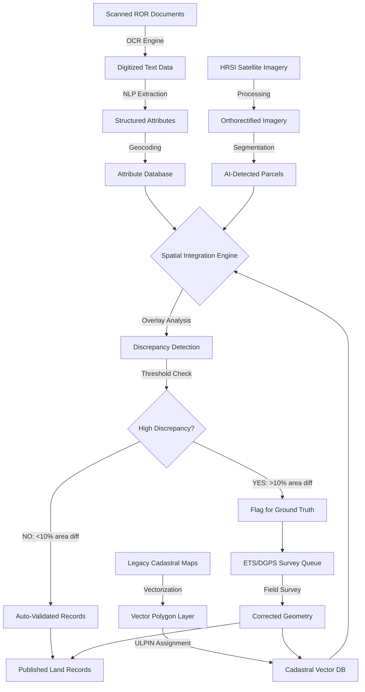
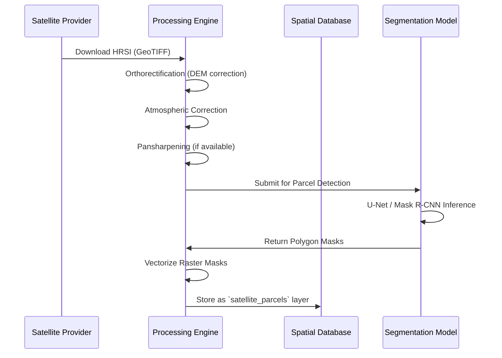

# Spatial Data Integration & Verification Architecture

**Version**: 1.0  
**Last Updated**: December 12, 2025  
**Status**: Active Development

## 📋 Executive Summary

This document outlines the architecture for integrating **OCR-digitized Record of Rights (ROR)**, **Vectorized Cadastral Maps**, and **High-Resolution Satellite Imagery (HRSI)** to create an intelligent land verification system. The goal is to minimize expensive ground surveys by using automated discrepancy detection to identify only those parcels requiring targeted field verification using ETS/DGPS equipment.

**Core Principle**: *Survey funds (DILRMP) should only be deployed where records are missing, destroyed, damaged, or show significant discrepancies with satellite imagery.*

---

## 🎯 System Objectives

1. **Automated Verification**: Use HRSI overlay techniques to validate digitized ROR data against ground truth
2. **Discrepancy Detection**: Identify high-priority areas with large geometric/attribute mismatches
3. **Targeted Resurvey**: Deploy expensive ground truthing (ETS/DGPS) only where necessary
4. **Cost Optimization**: Reduce blanket resurvey operations by 60-80% through intelligent filtering
5. **Data Quality**: Achieve >95% accuracy in parcel boundaries without full resurvey

---

## 🏗️ System Architecture

### High-Level Data Flow



---

## 🔍 Component Breakdown

### 1. OCR & NLP Layer

**Purpose**: Extract structured data from scanned ROR documents

**Technology Stack**:
- **OCR Engine**: Tesseract (Urdu + English) / Google Vision API
- **NLP Framework**: spaCy for entity extraction
- **Field Extraction**: Regex patterns for Khasra, Owner, Area, Crop

**Output Schema**:
```json
{
  "khasra_number": "123/4",
  "village": "AKHNOOR",
  "owner_name": "محمد احمد",
  "area_kanal": 5.25,
  "crop_type": "wheat",
  "confidence": 0.92
}
```

**Integration**: Feeds into Attribute Database with confidence scores

---

### 2. Cadastral Map Vectorization

**Purpose**: Convert legacy raster maps into editable vector polygons

**Workflow**:
1. **Scan Legacy Maps**: High-resolution (300+ DPI) scanning of sheet maps
2. **Georeferencing**: Align maps to WGS84 using ground control points
3. **Vectorization**: 
   - Manual digitization for critical areas
   - AI-assisted boundary extraction using CV models
4. **Topology Validation**: Ensure no gaps/overlaps between parcels
5. **ULPIN Assignment**: Generate unique identifiers from centroid coordinates

**Tools**:
- QGIS for manual editing
- GeoDjango / PostGIS for storage
- Custom Python scripts for batch processing

**Output**: `cadastral_parcels` table with `GEOMETRY(POLYGON)` and ULPIN

---

### 3. HRSI Processing Pipeline

**Purpose**: Extract actual land boundaries from satellite imagery

**Data Sources**:
- **Sentinel-2**: 10m resolution, free, 5-day revisit
- **Planet Labs**: 3m resolution, daily imaging (paid)
- **Cartosat-3**: 0.25m resolution, government procurement

**Processing Steps**:



**AI Model**:
- Architecture: Modified U-Net with ResNet50 backbone
- Training Data: 10,000+ manually labeled parcels
- Accuracy: IoU > 0.85 on validation set
- Inference: ~50 parcels/second on GPU

---

### 4. Spatial Integration Engine

**Purpose**: Overlay and compare three data sources to detect mismatches

**Key Algorithms**:

#### A. Geometric Overlay
```python
# Pseudo-code for overlay analysis
def detect_discrepancy(ror_attrs, cadastral_geom, satellite_geom):
    # 1. Match by Khasra Number
    cad_parcel = cadastral_db.get(khasra=ror_attrs['khasra_number'])
    sat_parcel = satellite_db.get_nearest(cad_parcel.centroid)
    
    # 2. Compute Area Difference
    area_diff_pct = abs(
        (sat_parcel.area - cad_parcel.area) / cad_parcel.area
    ) * 100
    
    # 3. Compute Shape Similarity (Hausdorff Distance)
    shape_diff = hausdorff_distance(cad_parcel, sat_parcel)
    
    # 4. Attribute Validation
    attr_match = (
        ror_attrs['area_kanal'] * 505.857  # Convert to sq.m
    ) - cad_parcel.area
    
    return {
        'area_discrepancy': area_diff_pct,
        'shape_discrepancy': shape_diff,
        'attribute_error': attr_match,
        'needs_survey': area_diff_pct > 10 or shape_diff > 15
    }
```

#### B. Confidence-Weighted Fusion
```python
def fuse_sources(ror, cadastral, satellite):
    # Weight by data quality
    weights = {
        'ror': 0.3 if ror['confidence'] > 0.9 else 0.1,
        'cadastral': 0.4 if cadastral['digitization_method'] == 'manual' else 0.2,
        'satellite': 0.5 if satellite['resolution'] < 1 else 0.3
    }
    
    # Normalize weights
    total = sum(weights.values())
    weights = {k: v/total for k, v in weights.items()}
    
    # Compute weighted centroid
    final_geom = weighted_union([
        (cadastral.geom, weights['cadastral']),
        (satellite.geom, weights['satellite'])
    ])
    
    return final_geom, weights
```

---

### 5. Discrepancy Detection & Prioritization

**Classification Logic**:

| Discrepancy Type | Threshold | Priority | Action |
|------------------|-----------|----------|--------|
| **Minor** | Area diff < 5%, Shape sim > 90% | LOW | Auto-accept satellite geometry |
| **Moderate** | Area diff 5-15%, Shape sim 70-90% | MEDIUM | Manual review queue |
| **Major** | Area diff > 15%, Shape sim < 70% | HIGH | Immediate ETS/DGPS survey |
| **Critical** | Multiple owners or missing records | URGENT | Full ground verification |

**Prioritization Factors**:
1. **Economic Value**: High-value land (urban, commercial) gets priority
2. **Dispute History**: Parcels with past litigation need verification
3. **Scheme Eligibility**: PM-KISAN beneficiaries prioritized
4. **Accessibility**: Remote areas batch-scheduled for cost efficiency

---

### 6. Ground Truthing Workflow

**When Survey is Required**:
- ✅ Records missing/destroyed
- ✅ Area discrepancy > 15%
- ✅ Boundary dispute reported
- ✅ New subdivision/consolidation
- ❌ Minor variations within tolerance
- ❌ High-confidence automated match

**Equipment**:
- **ETS (Electronic Total Station)**: Leica TS16 or equivalent
- **DGPS (Differential GPS)**: Trimble R12 with RTK correction
- **Software**: AutoCAD Civil 3D, Global Mapper

**Field Procedure**:
1. Load discrepancy report on tablet
2. Navigate to flagged parcel using ULPIN coordinates
3. Survey actual boundaries using ETS/DGPS
4. Collect photos and farmer attestation
5. Upload corrected geometry to central server
6. System auto-updates cadastral layer + ROR database

---

## 📊 Performance Metrics

| Metric | Target | Measurement Method |
|--------|--------|-------------------|
| **Automation Rate** | > 70% | % parcels verified without field survey |
| **False Positive** | < 5% | % auto-approved parcels later disputed |
| **Resurvey Cost Savings** | > ₹50 Cr/year | DILRMP budget vs actual deployment |
| **Processing Throughput** | 10K parcels/day | End-to-end pipeline capacity |
| **Accuracy** | > 95% | Post-survey validation vs ground truth |

---

## 🛠️ Technical Implementation

### Database Schema

```sql
-- Integrated Parcel Record
CREATE TABLE land_parcel_integrated (
    ulpin VARCHAR(14) PRIMARY KEY,
    khasra_number VARCHAR,
    
    -- Source Geometries
    ror_attributes JSONB,
    cadastral_geometry GEOMETRY(POLYGON, 4326),
    satellite_geometry GEOMETRY(POLYGON, 4326),
    survey_geometry GEOMETRY(POLYGON, 4326),  -- Ground truth if available
    
    -- Quality Metadata
    ror_confidence FLOAT,
    cadastral_source VARCHAR,  -- 'manual', 'ai_assisted', 'legacy'
    satellite_date DATE,
    satellite_resolution FLOAT,
    
    -- Discrepancy Flags
    area_discrepancy_pct FLOAT,
    shape_similarity FLOAT,
    needs_survey BOOLEAN DEFAULT FALSE,
    survey_priority INT,  -- 1=urgent, 5=low
    
    -- Final Published
    final_geometry GEOMETRY(POLYGON, 4326),  -- Best available
    verification_status VARCHAR  -- 'automated', 'surveyed', 'pending'
);

CREATE INDEX idx_needs_survey ON land_parcel_integrated(needs_survey) 
WHERE needs_survey = TRUE;
```

### API Endpoints

```python
# FastAPI endpoint for discrepancy analysis
@router.post("/api/v1/spatial/analyze-discrepancy")
async def analyze_parcel_discrepancy(ulpin: str):
    """
    Compare all available data sources for a parcel
    and return discrepancy report with survey recommendation.
    """
    parcel = await db.get_integrated_parcel(ulpin)
    
    report = {
        "ulpin": ulpin,
        "data_sources": {
            "ror": bool(parcel.ror_attributes),
            "cadastral": bool(parcel.cadastral_geometry),
            "satellite": bool(parcel.satellite_geometry)
        },
        "discrepancies": {
            "area_diff": parcel.area_discrepancy_pct,
            "shape_match": parcel.shape_similarity
        },
        "recommendation": {
            "needs_survey": parcel.needs_survey,
            "priority": parcel.survey_priority,
            "estimated_cost": calculate_survey_cost(parcel)
        }
    }
    
    return report
```

---

## 🚀 Deployment Strategy

### Phase 1: Pilot (3 months)
- **Scope**: 1 Tehsil (~5,000 parcels)
- **Goal**: Validate automated discrepancy detection
- **Deliverable**: Accuracy report + cost-benefit analysis

### Phase 2: District Rollout (6 months)
- **Scope**: Full district (~50,000 parcels)
- **Goal**: Scale processing pipeline
- **Deliverable**: Integrated platform with real-time monitoring

### Phase 3: State-Wide (18 months)
- **Scope**: All 20 districts (2M+ parcels)
- **Goal**: Complete digitization with minimal ground surveys
- **Impact**: Save ₹500+ Cr in resurvey costs

---

## 📚 References

- **DILRMP Guidelines**: Digital India Land Records Modernization
- **Sentinel-2 User Guide**: ESA Copernicus Program
- **ULPIN Specification**: `/backend/docs/ULPIN_SPECIFICATION.md`
- **OCR Architecture**: `/local_archive/documentation/Architecture_Stack/OCR_ARCHITECTURE.md`

---

**Next Steps**: Implement proof-of-concept for satellite-cadastral overlay module.
