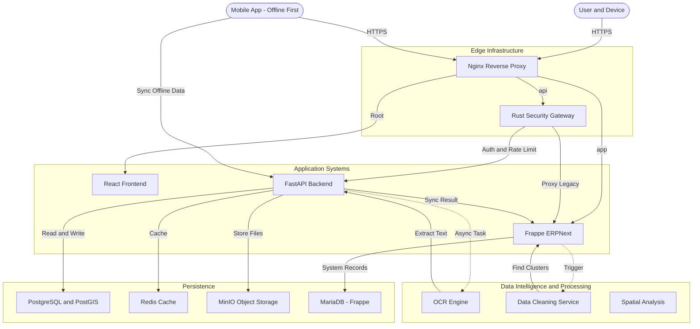
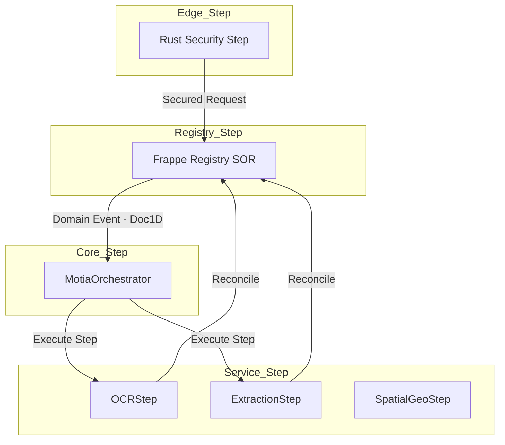

# Architectural Design and Method Document (ADMD)

**Version**: 2.0 (Motia-Unified Alignment)
**Date**: December 22, 2025
**Status**: Active Alignment

## 1. System Philosophy: The "Thinkable" Architecture
The platform is designed using **Motia Principles**, treating every backend concern as a unified **Step**. This approach ensures the system remains **logical, functional, and thinkable** across a multi-language (Polyglot) runtime.

### 1.1 The "Step" Primitive
A **Step** is the fundamental building block of our architecture. Each step encapsulates a specific configuration and a functional handler.
*   **Logical**: Decouples domain rules from infrastructure.
*   **Functional**: Clear Input (Events/Requests) -> Deterministic Processing -> Output (State/Events).
*   **Multi-Dev**: Allows Rust, Python, and Frappe logic to interact seamlessly within a single "Thinkable" flow.

## 0. System Context (Meridian Architecture)

## 1. Motia Logical Flow
The master flow revolves around the lifecycle of a **Document 1D**, orchestrated through sequential Step transitions across the layers defined above.

## 4. Logical Workflow Specifications

### 4.1 Step: Synchronous Ingress (Edge_Step)
*   **Implementation**: `rust-shield` as `Edge_Step`.
*   **Input**: External HTTPS Request.
*   **Logic**: JWT validation + `X-Motia-Step` injection.

### 4.2 Step: Asynchronous Orchestration (Core_Step)
*   **Implementation**: `MotiaOrchestrator` in `tasks.py`.
*   **Steps**: `StorageStep`, `OCRStep`, `ExtractionStep`, `RegistrySyncStep`.
*   **Functional Goal**: Convert raw inputs into structured Registry records.

### 4.3 Step: State Reconciliation
*   **Input**: `Service_Step` Result.
*   **Logic**: Results are bound back to the `Document 1D` in the `Registry_Step`.
*   **Thinkable Outcome**: The legal record transitions from "Processing" to "Verified".

---

## 5. Maintenance & Observability
By adhering to **Motia** patterns, every Step execution corresponds to a traceable point in the "Thinkable" map, simplifying multi-dev debugging and scaling.

**Note**: All implementation must prioritize **Document 1D** consistency to maintain cross-runtime functional integrity.

