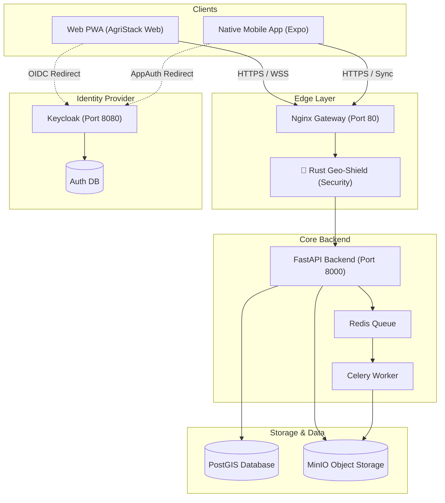

# 🌐 AgriStack Frontend Ecosystem Master Documentation

**Date:** December 9, 2025  
**Version:** 1.0.0 (Post-Consolidation)  
**Scope:** Web PWA (`frontend-landing`) & Mobile Native Integration (`mobile`)

---

## 🏗️ 1. High-Level Architecture

The frontend ecosystem consists of two primary client applications that interface with a unified backend microservice mesh.



---

## 💻 2. Web PWA Implementation (`frontend-landing`)

**Current Status:** Production-Ready Beta  
**Tech Stack:** React 18, Vite, TypeScript, TailwindCSS, Framer Motion, React OIDC Context.

### Core Modules & Development Status

| Module | Feature | Implementation Details | Status |
|--------|---------|------------------------|--------|
| **Authentication** | OIDC Integration | Uses `react-oidc-context` with Keycloak. Auto-syncs Access Token to Axios client. Shows user profile in Sidebar. | ✅ **Live** |
| **Dashboard** | Real-Time Monitor | Polls `/parcels/stats`, visualizes "Live Feed" CSS animations, tracks active agents and daily uploads. | ✅ **Live** |
| **Registry** | Land Record Grid | Fetches live data from `/api/v1/parcels/`. Implements client-side search (Owner, Khasra) and status filtering (Active, Disputed). Includes visual "Live Data" vs "Demo Mode" badge. | ✅ **Live** |
| **Map View** | Geospatial Vis | Utilizes `MapLibre GL JS`. Renders GeoJSON from `/api/v1/parcels/geojson`. Features interactive pinning, fly-to, and dark mode styling. | ✅ **Live** |
| **Review Queue** | OCR Validation | Interface for correcting OCR data. Connected to `/api/v1/reviews/pending`. (Note: Component exists `ReviewQueue.tsx`, feature folder planned). | 🟡 **Beta** |
| **Security** | Audit Logging | All API interactions trigger `API_REQUEST_STARTED` and `_FAILED` events in backend audit logs. | ✅ **Live** |

### Backend Redirects & Proxying
*   **Development:** Vite Proxy (`vite.config.ts`) forwards `/api/v1/*` -> `http://localhost:8000`.
*   **Production:** Nginx forwards `/` to static files and `/api/v1` to the backend container.

---

## 📱 3. Mobile Application Integration (`mobile`)

**Current Status:** Offline-First Native App  
**Tech Stack:** React Native (Expo), SQLite (Local DB), Expo FileSystem, Vision Camera.

### Specific Backend Connections

The mobile app does **not** rely on simple REST fetching for its core operations. It uses a **Delta Sync Engine**.

#### 1. Delta Sync (Downstream)
*   **Endpoint:** `GET /api/v1/sync/changes?since={timestamp}`
*   **Mechanism:** The app requests only records changed since its `last_sync_timestamp`.
*   **Optimization:** Minimizes bandwidth usage in rural areas (2G/3G compatible).

#### 2. Atomic Batch Push (Upstream)
*   **Endpoint:** `POST /api/v1/sync/batch`
*   **Payload:**
    ```json
    {
      "parcels": [{...}, {...}],
      "persons": [{...}]
    }
    ```
*   **Mechanism:** Uploads all offline creations/edits in a single transaction. If one fails, the batch is reported with errors.

#### 3. Conflict Resolution
*   **Endpoint:** `/api/v1/sync/conflict/check`
*   **Logic:** The app detects if the server version > local version. If so, it flags the record as `conflict` and requests a 3-way diff from the backend to present to the user.

### Detailed Mobile Architecture

The mobile app is built with a role-based, modular architecture to support specialized field operations.

```mermaid
graph TD
    subgraph "Navigation & State"
        Nav[NavigationContainer]
        Redux[Redux Store]
        AuthSlice[Auth Slice]
    end

    subgraph "Role-Based Stacks"
        RoleSel[Role Selection Screen]
        OpStack[Operator Stack]
        VerStack[Verifier Stack]
        TahStack[Tahsildar Stack]
    end

    subgraph "Feature Screens"
        OpDash[Operator Dashboard]
        Cam[Scan Document (Vision Camera)]
        SyncUI[Offline Sync Screen]
        Transfer[Ownership Transfer]
    end

    subgraph "Core Services"
        Sync[SyncService (Delta)]
        OCR[OCRService (Async)]
        DB[SQLite Database]
    end

    %% Flow
    Nav --> RoleSel
    RoleSel -->|Login as Patwari| OpStack
    RoleSel -->|Login as Girdawar| VerStack
    
    OpStack --> OpDash
    OpDash --> Cam
    OpDash --> SyncUI
    
    %% Data Flow
    Cam --> OCR
    OpDash --> Redux
    SyncUI --> Sync
    Sync <--> DB
```

| Component | Responsibility | Implementation Details |
|-----------|----------------|------------------------|
| **Navigation** | Role-based routing | `Stack.Navigator` separates flows (Operator, Verifier, Field Team). |
| **Redux Store** | Global State | `authSlice` manages user identity and active role. |
| **Services Layer** | logic encapsulation | Separated into `api.ts`, `sync.ts`, `ocr.ts`, `storage.ts`. |
| **UI System** | Consistency | Shared `Colors` system and reusable `ProcessStatus` components. |

---

## 🔗 4. API & Resource Map

| Consumer | Resource | Endpoint | Auth Scope |
|----------|----------|----------|------------|
| **Web** | Dashboard Stats | `GET /parcels/stats/farmers` | User |
| **Web** | Registry List | `GET /parcels/` | User |
| **Web** | Map Data | `GET /parcels/geojson` | User |
| **Web** | Async OCR | `POST /ocr/run-async` | Admin |
| **Mobile** | Sync Changes | `GET /sync/changes` | Field Agent |
| **Mobile** | Upload Batch | `POST /sync/batch` | Field Agent |
| **Shared** | Auth Token | `POST /realms/agristack/protocol/openid-connect/token` | Public |


### Frontend Internal Architecture

```mermaid
graph TD
    subgraph Providers
        Auth[AuthProvider]
        Settings[SettingsContext]
    end

    subgraph Layout
        App[App.tsx]
        Side[Sidebar]
        Main[Main Container]
        Land[LandingPage]
    end

    subgraph Views
        Dash[Dashboard]
        Reg[Registry]
        Map[MapView]
        Rev[ReviewQueue]
    end

    subgraph Data_Layer
        API[API Client]
        Store[Local Store]
    end

    %% Flow
    App --> Auth
    Auth --> Settings
    
    %% Auth Switch
    Settings -->|Not Auth| Land
    Settings -.->|Auth| Side
    Settings -.->|Auth| Main

    %% Routing
    Main --> Dash
    Main --> Reg
    Main --> Map
    Main --> Rev

    %% Data Dependencies
    Dash -.-> API
    Reg -.-> API
    Map -.-> API
    Land --Login--> Auth
