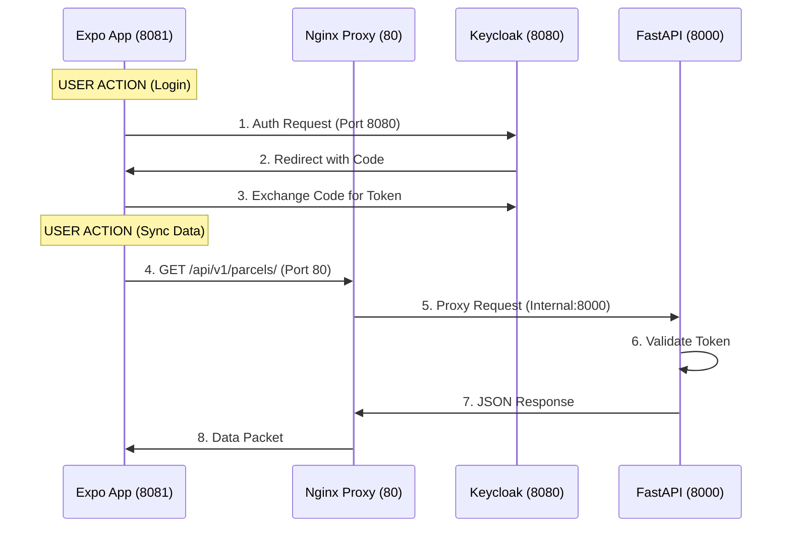

# 🔌 NATIVE EXPO TO BACKEND INTEGRATION GUIDE

This document lists the exact connection points, ports, and APIs linking the **React Native (Expo)** frontend to the **FastAPI Backend**.

---

## 🚀 Connection Overview

| Component | Technology | Port (Host) | Port (Internal) | Base URL |
|-----------|------------|-------------|-----------------|----------|
| **Frontend** | React Native (Expo) | 8081 | 8081 | `exp://localhost` |
| **Gateway** | Nginx Proxy | **80** | 80 | `http://localhost:80` |
| **Auth** | Keycloak | **8080** | 8080 | `http://localhost:8080` |
| **Backend** | Python FastAPI | 8000 | 8000 | `http://backend:8000` |

---

## 🔗 1. API GATEWAY (THE PRIMARY BRIDGE)
All Application data requests flow through **Port 80** (Nginx), which proxies to the internal Backend service.

### **Connection Config**
**File**: `mobile/src/api/client.ts`
```typescript
const BASE_URL = Platform.select({
    ios: 'http://localhost:80/api/v1',
    android: 'http://10.0.2.2:80/api/v1',
});
```

### **API Mappings**
| Endpoint Route | Expo Usage | Backend Service | Function |
|----------------|------------|-----------------|----------|
| `/api/v1/parcels/` | `GET` | FastAPI (8000) | Pull data sync |
| `/api/v1/sync/push` | `POST` | FastAPI (8000) | Upload offline changes |
| `/api/v1/geo/tiles/{z}/{x}/{y}` | `GET` | FastAPI (8000) | Map Vector Tiles |

---

## 🔐 2. AUTHENTICATION BRIDGE (OAUTH2)
Authentication flow bypasses Nginx for direct interaction with the Identity Provider during login, then validates via API.

### **Connection Config**
**File**: `mobile/src/services/AuthService.ts`
```typescript
const KEYCLOAK_URL = Platform.select({
    ios: 'http://localhost:8080',
    android: 'http://10.0.2.2:8080',
});
```

### **Auth Flow Ports**
1.  **Login Request**: Mobile → `localhost:8080` (Browser opens)
2.  **Redirect**: Keycloak → `exp://localhost:8081` (Deep Link back to App)
3.  **Token Exchange**: Mobile → `localhost:8080` (POST request)
4.  **API Verification**: Mobile → `localhost:80` (Authorization Header) → Backend validates with Keycloak

---

## 🔄 3. DATA FLOW DIAGRAM



---

## 🛠️ CRITICAL PORTS FOR DEBUGGING

-   **Backend API Check**: `curl -I http://localhost:80/api/v1/`
    -   *Success*: HTTP 200/401/404 (Gateway Reached)
    -   *Fail*: Connection Refused (Nginx Down)
-   **Auth Check**: `curl -I http://localhost:8080/`
    -   *Success*: HTTP 200 (Keycloak Up)
    -   *Fail*: Connection Refused (Keycloak Down)
