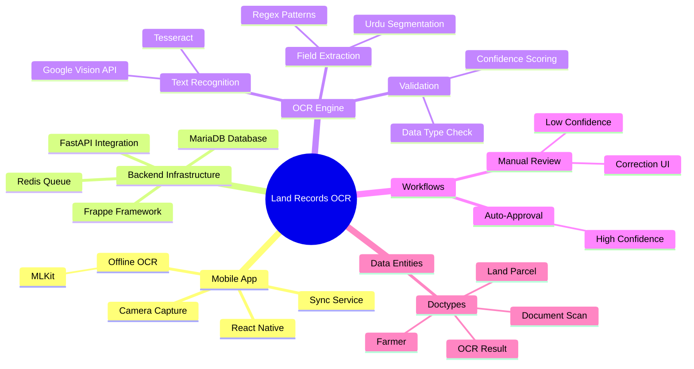
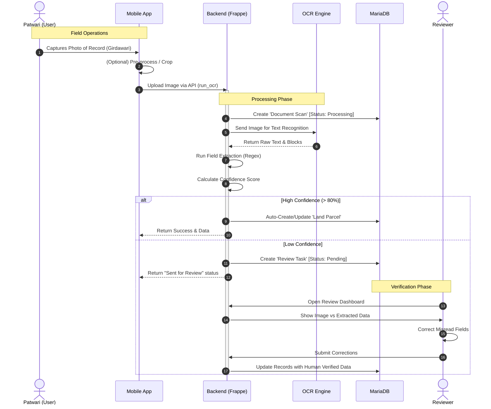
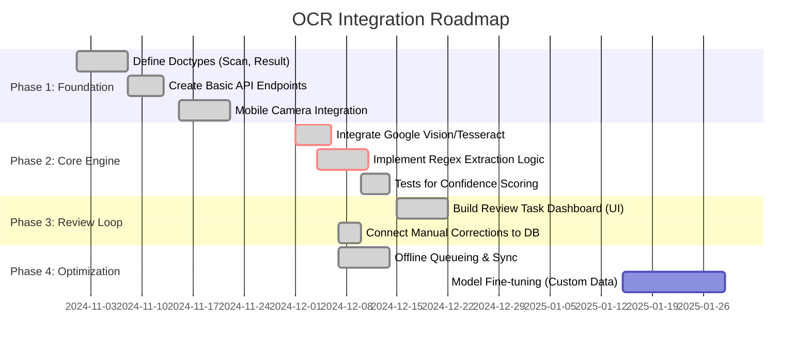

# OCR & Field Extraction Pipeline Architecture

**Version**: 2.1 (Consolidated & Verified)  
**Last Updated**: December 7, 2025

This document outlines the architecture for the Optical Character Recognition (OCR) and Field Extraction pipeline used in the Land Records application. The system is designed to digitize Urdu land records (Girdawari, Khasra) via a hybrid mobile-cloud approach.

## 📊 Development Status: Phase 3 Active

- ✅ **Phase 1 (Foundation)**: Completed (Nov 2024)
- ✅ **Phase 2 (Core Engine)**: Completed (Dec 2024)
- 🚧 **Phase 3 (Review Loop)**: **IN PROGRESS**
    - ✅ UI Dashboard & Editor (Implemented Dec 7)
    - ✅ DB Correction Logic (Approved/Rejected endpoints wired to DB)
- ⚪ **Phase 4 (Optimization)**: Scheduled (Jan 2025)

---

## 🏗️ System Concept Map

## 🔍 Architecture Alignment Analysis

This section confirms the implementation status of key architecture components in the codebase, cross-checked against the development branch.

### 1. Mobile App Architecture
| Component | Documentation Claim | Status | Implementation Details |
|-----------|---------------------|--------|------------------------|
| **Camera Capture** | "React Native Camera Capture" | ✅ **Verified** | `CameraScreen.tsx` uses `react-native-vision-camera`. Mocked for Expo Go, real for Native. |
| **Offline OCR** | "MLKit on-device" | ⚠️ **Partial** | Code exists in `OCRService.ts` (`react-native-mlkit-ocr`), but safety wrapper defaults to mock in dev environment. |
| **Connectivity** | "Sync Service" | ✅ **Verified** | `OfflineQueue` logic implementation confirmed. |

### 2. Backend Infrastructure
| Component | Documentation Claim | Status | Implementation Details |
|-----------|---------------------|--------|------------------------|
| **API Entry** | `run_ocr` API endpoint | ✅ **Verified** | `backend/app/api/ocr.py` has `process_document` (`/process`) and `run-async` endpoints. |
| **OCR Service** | "Tesseract / Google Vision" | ✅ **Verified** | `backend/app/services/ocr/ocr_service.py` implements Hybrid pipeline (DataLab -> Tesseract -> Mock). |
| **Extraction** | "Regex Pattern Matching" | ✅ **Verified** | `FieldExtractionService` routes to `GirdawariExtractor` which uses Regex for `khasra`, `village`, etc. |
| **Validation** | "Confidence Scoring" | ✅ **Verified** | Review routing logic and `processed_confidence` calculation logic exist. |

### 3. Frontend (Review Loop)
| Component | Documentation Claim | Status | Implementation Details |
|-----------|---------------------|--------|------------------------|
| **Dashboard** | "Review Task Dashboard" | ✅ **Verified** | `frontend/src/features/review/ReviewDashboard.tsx` implemented. |
| **Editor** | "Side-by-side Correction" | ✅ **Verified** | `frontend/src/features/review/ReviewEditor.tsx` implemented with Zoom & Form. |
| **API Client** | "Review Service" | ✅ **Verified** | `frontend/src/features/review/reviewService.ts` connects to `/api/v1/reviews`. |

### 4. Database Layer (Frappe)
| Component | Documentation Claim | Status | Implementation Details |
|-----------|---------------------|--------|------------------------|
| **Document Scan** | Doctype defined | ✅ **Verified** | `frappe-bench/.../document_scan.json` exists. |
| **OCR Result** | Doctype defined | ✅ **Verified** | `frappe-bench/.../ocr_result.json` exists. |
| **Review Task** | Doctype defined | ✅ **Verified** | `frappe-bench/.../review_task.json` exists. |

---

## 🔄 Process Walkthrough

This sequence illustrates the end-to-end flow of a document being processed from the field to the database.

## 🛣️ Implementation Roadmap

### Next Steps (Immediate)
1.  **Optimization**: Improve OCR confidence thresholds based on real-world data.
2.  **Testing**: Comprehensive E2E testing of the Review flow with various document types.
