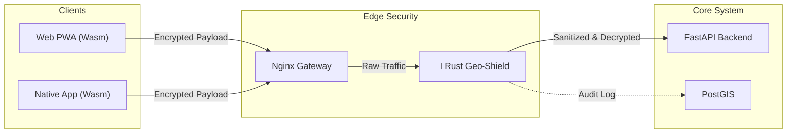

# 🛡️ Rust-Based Security Architecture: "GeoShield"

**Date:** December 9, 2025  
**Status:** Architecture Defined (Phase 4 Upgrade)  
**Technology:** Rust (Actix-web / Axum), WebAssembly (Wasm)

---

## 1. Overview

To protect sensitive **Geo-Informatics Data** (Land Parcels, Coordinates, Ownership maps), we are introducing a high-performance **Rust Security Layer** ("GeoShield"). 

This layer acts as a **Security Sidecar** for the backend and a **Wasm Crypto Module** for clients (Frontend & Native), ensuring end-to-end data integrity and encryption.

---

## 2. Architecture Diagram

---

## 3. Core Components

### 🦀 A. The Rust Shield (Server-Side)
Sits between Nginx and FastAPI.
*   **Function**: 
    1.  **Request Validation**: Zero-copy parsing of JSON payloads to reject malformed requests before they hit Python.
    2.  **Geo-Fencing**: Fast point-in-polygon checks to ensure requested data is within allowed administrative boundaries (Tehsil/District).
    3.  **Audit Tapping**: Asynchronously logs high-frequency events to a separate security queue without blocking the main API.

### 📦 B. Wasm Crypto Module (Client-Side)
A shared Rust library compiled to WebAssembly for Web and referenced via FFI for Mobile.
*   **Function**:
    1.  **Payload Encryption**: Encrypts sensitive coordinate arrays *before* they leave the device using `ChaCha20-Poly1305`.
    2.  **Edge Verification**: Verifies digital signatures of downloaded map tiles to prevent tampering.

---

## 4. Implementation Strategy

### Phase 4.1: The Shield service
*   **Stack**: Rust + Axum.
*   **Deployment**: Docker container `land_records_shield`.
*   **Integration**: Nginx `upstream` points to `shield:8080`, Shield forwards to `backend:8000`.

### Phase 4.2: Client Integration
*   **Web**: `import init, { encrypt_coords } from './libs/geoshield_wasm'`
*   **Mobile**: JSI binding to the native Rust library.

---

## 5. Security Policies

1.  **Zero Trust Geo-Data**: Coordinates are treated as PII (Personally Identifiable Information). They are encrypted at rest and only decrypted by the Rust layer for processing or the Authorized Client for viewing.
2.  **Rate Limiting**: Rust layer implements a Token Bucket algorithm per IP/User ID to prevent scraping of land records.
