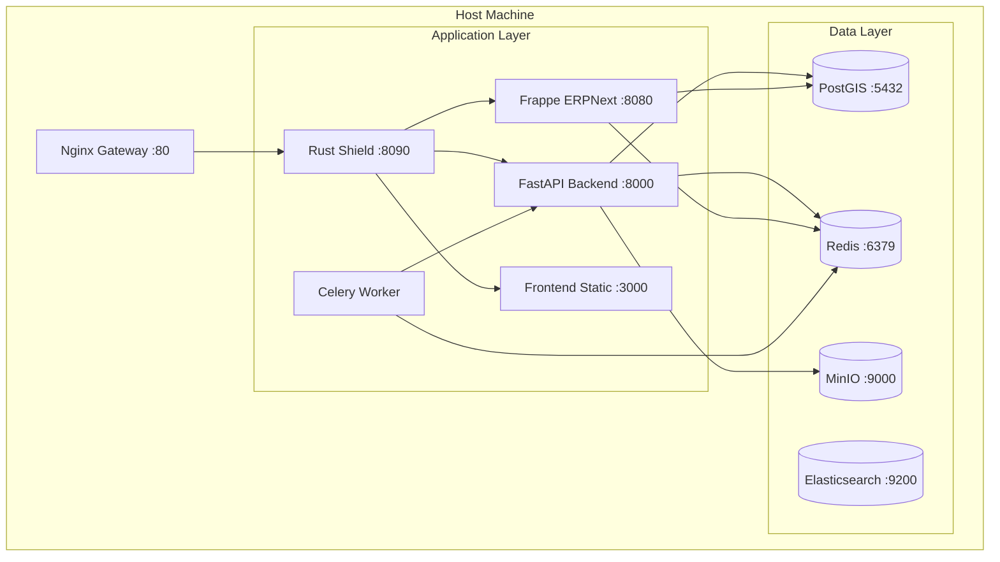

# Docker & Host Architecture

## 1. Scope & Responsibility
Orchestration of the entire microservice ecosystem using Docker Compose.
*   **Role**: Service Orchestration, Networking, and Resource Management.
*   **Environment**: Production (Linux/Alpine) & Development (Mac/Linux).

## 2. Architecture: Container Map


## 3. Configuration & Networking
### 3.1 Network Topology
All services run on the `jk-network` bridge network.
*   **Gateway**: `172.x.0.1`
*   **DNS Resolution**: Internal Docker DNS (e.g., `ping backend`, `ping redis`).

### 3.2 Volume Management
*   `postgres_data`: Persistent storage for PostGIS.
*   `minio_data`: Object storage for OCR images.
*   `redis_data`: Queue persistence.
*   `frappe_sites`: Shared volume for ERPNext logic.

## 4. Logical Functions & Scripts
### 4.1 Host Gateway (`host.docker.internal`)
Configured to allow containers to access services running on the host machine (e.g., local LLMs, specialized debuggers).
```yaml
extra_hosts:
  - "host.docker.internal:host-gateway"
```

### 4.2 Production Toggles
*   **Dev**: `docker-compose.yml` (Hot reload enabled, exposed ports).
*   **Prod**: `docker-compose.prod.yml` (Optimized images, internal routing only).

## 5. Endpoints & Ports (Exposed)
*   **Public Edge**: `8090` (Rust Shield)
*   **Direct API**: `8000` (FastAPI - Dev Only)
*   **Direct ERP**: `8080` (Frappe - Dev Only)
*   **Monitoring**: `9090` (Prometheus), `3001` (Grafana)

## 6. Code Locations
*   **Orchestration**: `docker-compose.yml`, `docker-compose.prod.yml`
*   **Config**: `config/`, `.env`
*   **Gateway**: `nginx/`, `rust-shield/`
