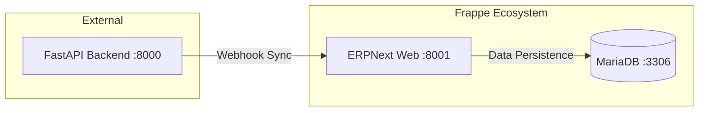

# Frappe Integration Architecture

## 1. Scope & Responsibility
Defines Frappe (ERPNext) as the **System of Record** for Land Records.
*   **Role**: Primary Data Source & Admin Backend.

## 2. Architecture: Current Bridge (As-Is)

*   *Note: Mismatch - Direct DB access avoided; API uses Webhooks.*

## 3. Endpoints & Ports
*   **Port**: `8001` (Mapped to 8000 internal)
*   **Endpoints**:
    *   `POST /frappe/webhook` (Backend listener)
    *   `GET /frappe/health`

## 4. Credentials (Dev)
*   **URL**: `http://localhost:8001`
*   **User**: `Administrator`
*   **Password**: `admin`

## 5. Code & Scripts
*   **Code**: `frappe-bench/apps/land_records/`
*   **Script**: `backend/scripts/setup_frappe_script.py`
