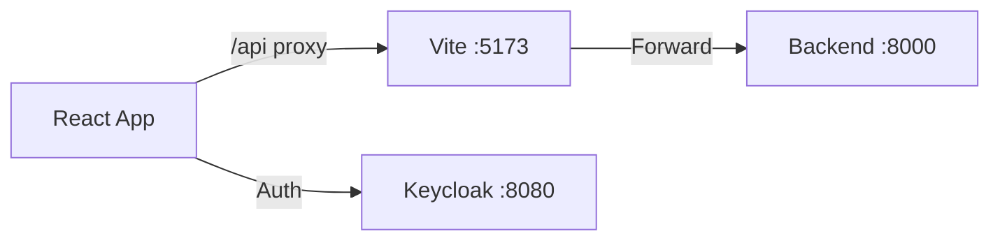

# Frontend Architecture (Web)

## 1. Scope & Responsibility
Web Dashboard for Verifiers and Operators.

## 2. Architecture: Dev Proxy (As-Is)

## 3. Endpoints & Ports
*   **Port**: `5173` (Dev), `:80` (Prod)
*   **Endpoints**: Consumes `/parcels/*`, `/reviews/*`.

## 4. Credentials (Dev)
*   **URL**: `http://localhost:5173`
*   **User**: `admin`
*   **Password**: `admin` (Keycloak Login)

## 5. Code & Scripts
*   **Code**: `frontend-landing/src/`
*   **Script**: `npm run dev`
