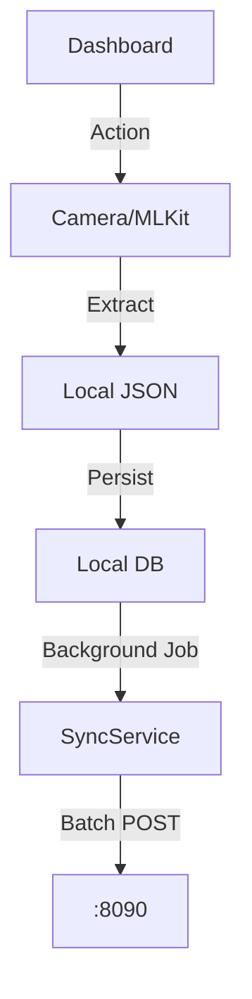

# Native Architecture (Mobile)

## 0. System Context (Meridian Architecture)
```mermaid
graph TD
    %% -- User Layer --
    User([User / Device])
    Mobile([Mobile App (Offline First)])
    
    %% -- Edge Layer --
    subgraph Edge_Infrastructure [Edge Infrastructure]
        Nginx[Nginx Reverse Proxy\n(Port 80/443)]
        Gateway[Rust Security Gateway\n(Port 8090)]
    end

    %% -- Application Layer --
    subgraph App_Layer [Application Systems]
        Frontend[React Frontend\n(Static Serve)]
        Backend[FastAPI Backend\n(OCR / Spatial / Dedupe)]
        Frappe[Frappe / ERPNext\n(System of Record)]
    end

    %% -- Data Intelligence Layer --
    subgraph Intelligence [Data Intelligence & Processing]
        OCR_Worker[OCR Engine\n(Tesseract/EasyOCR)]
        Dedupe[Data Cleaning Service\n(Python Algorithm)]
        Geo_Engine[Spatial Analysis\n(PostGIS/Shapely)]
    end

    %% -- Persistence Layer --
    subgraph Data_Layer [Persistence]
        PSQL[(PostgreSQL + PostGIS)]
        Redis[(Redis Cache)]
        MinIO[(MinIO Object Storage)]
        MariaDB[(MariaDB - Frappe)]
    end

    %% -- Flows --
    User -->|HTTPS| Nginx
    Mobile -->|HTTPS| Nginx

    Nginx -->|/ (Root)| Frontend
    Nginx -->|/api| Gateway
    Nginx -->|/app| Frappe

    Gateway -->|Auth & Rate Limit| Backend
    Gateway -->|Proxy Legacy| Frappe
    
    Backend -->|Read/Write| PSQL
    Backend -->|Cache| Redis
    Backend -->|Store Files| MinIO
    
    Frappe -->|System Records| MariaDB
    
    %% -- Logic Flows --
    Backend -.->|Async Task| OCR_Worker
    OCR_Worker -->|Extract Text| Backend
    Backend -->|Sync Result| Frappe
    
    Frappe -.->|Trigger| Dedupe
    Dedupe -->|Find Clusters| Frappe
    
    Mobile -->|Sync Offline Data| Backend
```

## 1. Scope & Responsibility
Offline Data Collection (Field App) built with React Native (Expo).
*   **Role**: Offline OCR, Field Survey, Farmer Enrollment.
*   **Target**: Android (Tablets) & iOS.

## 2. Architecture: Offline-First Flow


## 3. Logical Functions & Data
### 3.1 Offline Sync Queue
Stored in `AsyncStorage` / SQLite.
```json
{
  "queue_id": "uuid-v4",
  "type": "PARCEL_CREATE",
  "payload": {
    "khasra": "124/A",
    "owner": "Farmer A",
    "geom": "POINT(75.1 32.2)"
  },
  "status": "PENDING",
  "retry_count": 0
}
```

### 3.2 Operator Dashboard
*   **Visuals**: High-Contrast (OLED Black) for outdoor visibility.
*   **Components**:
    *   `QuickActions`: Scan, Sync, Map.
    *   `RecentActivity`: Local history of sync jobs.
    *   `ProcessStatus`: Visual indicator of backend processing state.

## 4. Endpoints & Config
*   **Gateway URL**: `https://api.jk-land.gov.in` (Prod) / `http://192.168.x.x:8090` (Dev).
*   **Auth Flow**: Keycloak (AppAuth) -> Access Token -> Stored in SecureStore.

### 4.1 Developer API Reference (Sync & Auth)
These endpoints are critical for the mobile app's offline-first functionality.

| Feature | Method | Endpoint | Purpose |
| :--- | :--- | :--- | :--- |
| **Auth** | `POST` | `/auth/token` | Keycloak token exchange (PKCE) |
| **Sync** | `POST` | `/api/v1/sync/batch` | Uploads queued offline actions (Parcels, OCR) |
| **Sync** | `GET` | `/api/v1/sync/status/{batch_id}` | Checks if background processing finished |
| **OCR** | `POST` | `/api/v1/ocr/upload` | Direct upload of captured images (if online) |
| **Profile** | `GET` | `/api/v1/users/me` | Fetches operator details (Name, Village Scope) |

## 5. Directory Structure
```
mobile/src/
├── screens/
│   ├── dashboard/          # Operator Dashboard
│   ├── landRecords/        # OCR & Survey Forms
│   └── offline/            # Sync Status UI
├── services/
│   ├── api.ts              # Axios + Interceptors
│   └── BackgroundSync.ts   # TaskManager logic
└── styles/
    └── colors.ts           # High Contrast Token
```
