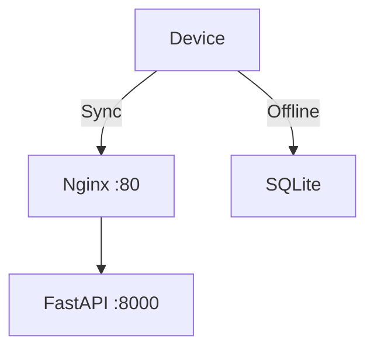

# Native Architecture (Mobile)

## 1. Scope & Responsibility
Offline Data Collection and Field Verification.

## 2. Architecture: Direct/Nginx (As-Is)

## 3. Endpoints & Ports
*   **Port**: N/A (Client), Connects to `80`.
*   **Endpoints**:
    *   `GET /sync/changes`
    *   `POST /sync/batch`

## 4. Credentials (Dev)
*   **User**: `operator` / `operator123`
*   **Pin**: `1234` (If configured)

## 5. Code & Scripts
*   **Code**: `mobile/src/`
*   **Script**: `npm start` (Expo)
