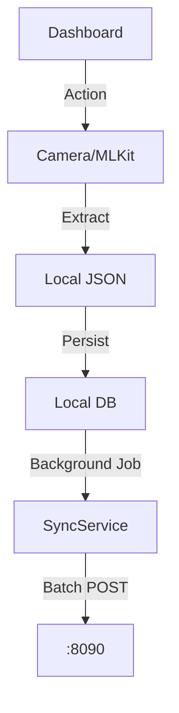

# Native Architecture (Mobile)

## 1. Scope & Responsibility
Offline Data Collection (Field App) built with React Native (Expo).
*   **Role**: Offline OCR, Field Survey, Farmer Enrollment.
*   **Target**: Android (Tablets) & iOS.

## 2. Architecture: Offline-First Flow


## 3. Logical Functions & Data
### 3.1 Offline Sync Queue
Stored in `AsyncStorage` / SQLite.
```json
{
  "queue_id": "uuid-v4",
  "type": "PARCEL_CREATE",
  "payload": {
    "khasra": "124/A",
    "owner": "Farmer A",
    "geom": "POINT(75.1 32.2)"
  },
  "status": "PENDING",
  "retry_count": 0
}
```

### 3.2 Operator Dashboard
*   **Visuals**: High-Contrast (OLED Black) for outdoor visibility.
*   **Components**:
    *   `QuickActions`: Scan, Sync, Map.
    *   `RecentActivity`: Local history of sync jobs.
    *   `ProcessStatus`: Visual indicator of backend processing state.

## 4. Endpoints & Config
*   **Gateway URL**: `https://api.jk-land.gov.in` (Prod) / `http://192.168.x.x:8090` (Dev).
*   **Auth Flow**: Keycloak (AppAuth) -> Access Token -> Stored in SecureStore.

## 5. Directory Structure
```
mobile/src/
├── screens/
│   ├── dashboard/          # Operator Dashboard
│   ├── landRecords/        # OCR & Survey Forms
│   └── offline/            # Sync Status UI
├── services/
│   ├── api.ts              # Axios + Interceptors
│   └── BackgroundSync.ts   # TaskManager logic
└── styles/
    └── colors.ts           # High Contrast Token
```
