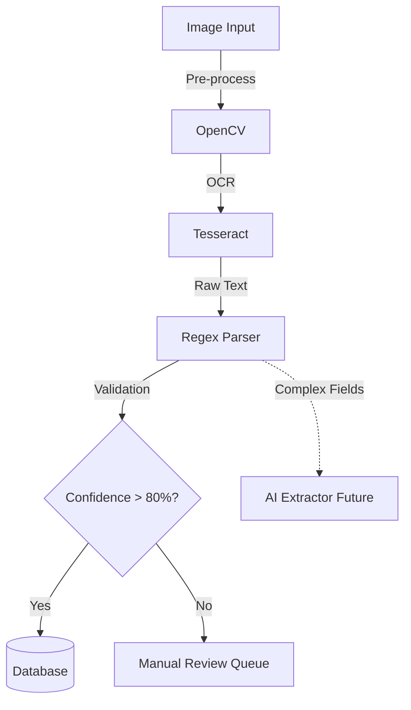

# OCR & Geo Intelligence Architecture

## 0. System Context (Meridian Architecture)
```mermaid
flowchart TD
    %% -- User Layer --
    User(["User / Device"])
    Mobile(["Mobile App (Offline First)"])
    
    %% -- Edge Layer --
    subgraph Edge_Infrastructure [Edge Infrastructure]
        Nginx["Nginx Reverse Proxy\n(Port 80/443)"]
        Gateway["Rust Security Gateway\n(Port 8090)"]
    end

    %% -- Application Layer --
    subgraph App_Layer [Application Systems]
        Frontend["React Frontend\n(Static Serve)"]
        Backend["FastAPI Backend\n(OCR / Spatial / Dedupe)"]
        Frappe["Frappe / ERPNext\n(System of Record)"]
    end

    %% -- Data Intelligence Layer --
    subgraph Intelligence [Data Intelligence & Processing]
        OCR_Worker["OCR Engine\n(Tesseract/EasyOCR)"]
        Dedupe["Data Cleaning Service\n(Python Algorithm)"]
        Geo_Engine["Spatial Analysis\n(PostGIS/Shapely)"]
    end

    %% -- Persistence Layer --
    subgraph Data_Layer [Persistence]
        PSQL[("PostgreSQL + PostGIS")]
        Redis[("Redis Cache")]
        MinIO[("MinIO Object Storage")]
        MariaDB[("MariaDB - Frappe")]
    end

    %% -- Flows --
    User -->|HTTPS| Nginx
    Mobile -->|HTTPS| Nginx

    Nginx -->|/ (Root)| Frontend
    Nginx -->|/api| Gateway
    Nginx -->|/app| Frappe

    Gateway -->|Auth & Rate Limit| Backend
    Gateway -->|Proxy Legacy| Frappe
    
    Backend -->|Read/Write| PSQL
    Backend -->|Cache| Redis
    Backend -->|Store Files| MinIO
    
    Frappe -->|System Records| MariaDB
    
    %% -- Logic Flows --
    Backend -.->|Async Task| OCR_Worker
    OCR_Worker -->|Extract Text| Backend
    Backend -->|Sync Result| Frappe
    
    Frappe -.->|Trigger| Dedupe
    Dedupe -->|Find Clusters| Frappe
    
    Mobile -->|Sync Offline Data| Backend
```

## 1. Scope & Responsibility
Hybrid OCR pipeline combining Tesseract (On-Prem) and LLM-based extraction.
*   **Role**: Convert scanned Urdu/English Land Records (Girdawari) to Structured Data.
*   **Engine**: Tesseract 5 (Primary) + AI Fallback.

## 2. Architecture: Extraction Pipeline


## 3. Logical Functions & Data
### 3.1 Extraction Response JSON
Output from `/ocr/extract-fields`.
```json
{
  "request_id": "ocr-123",
  "status": "success",
  "extracted_data": {
    "khasra_number": "45/2",
    "owner_name": "Rahim Khan",
    "area_kanal": "4.5",
    "crop_type": "Wheat",
    "village": "Srinagar-North"
  },
  "confidence_score": 0.88,
  "needs_review": false,
  "bounding_boxes": [
    {"field": "khasra_number", "box": [10, 20, 100, 50]}
  ]
}
```

### 3.2 Key Modules
*   `ocr_service.py`: Orchestrates the Tesseract process.
*   `ai_extractor.py`: Interface for LLM-based cleanup (currently mocked).
*   `regex_parser.py`: Urdu/English pattern matching.

## 4. Endpoints & Ports
*   **Port**: `8000` (Backend)
*   **Endpoints**:
    *   `POST /api/v1/ocr/process` (Synchronous)
    *   `POST /api/v1/ocr/async` (Background Task)

## 5. Code Locations
*   **Service**: `backend/app/services/extraction/`
*   **API**: `backend/app/api/v1/ocr.py`
