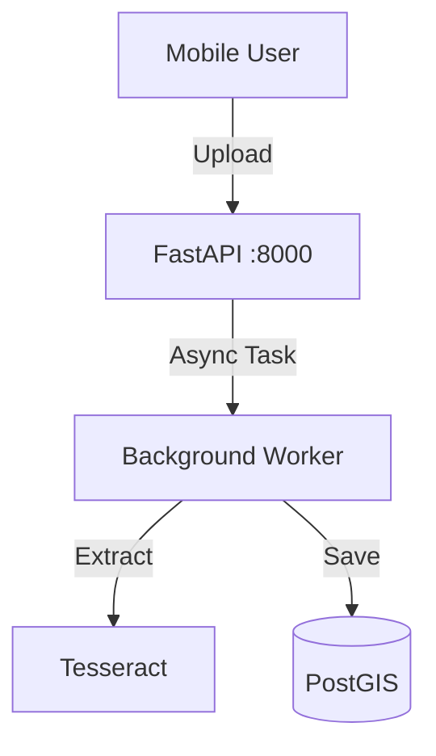

# OCR & Geo Intelligence Architecture

## 1. Scope & Responsibility
Document ingestion, text extraction, and geospatial linking.

## 2. Architecture: Hybrid Flow (As-Is)

*   *Status*: Tesseract active; AI/LLM mocked.

## 3. Endpoints & Ports
*   **Port**: `8000`
*   **Endpoints**:
    *   `POST /ocr/run-async`
    *   `POST /ocr/extract-fields`

## 4. Credentials (Dev)
*   **Role**: `enumerator`
*   **Auth**: Bearer Token (via Keycloak)

## 5. Code & Scripts
*   **Code**: `backend/app/api/ocr.py`
*   **Script**: `test-backend.sh` (Tests OCR endpoints)
