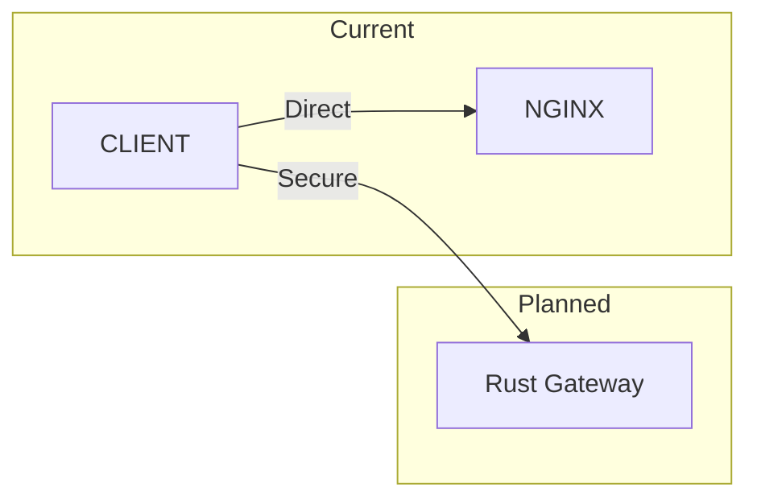

# Rust Gateway Architecture

## 1. Scope & Responsibility
Security Gateway (Future Phase 4).

## 2. Architecture: Scaffolding (Bridge)

*   *Status*: **Bypassed** in Dev. Code exists but not active.

## 3. Endpoints & Ports
*   **Planned Port**: `8080`

## 4. Credentials
*   *N/A - Service Inactive*

## 5. Code & Scripts
*   **Code**: `rust-shield/`
*   **Script**: `cargo run`
