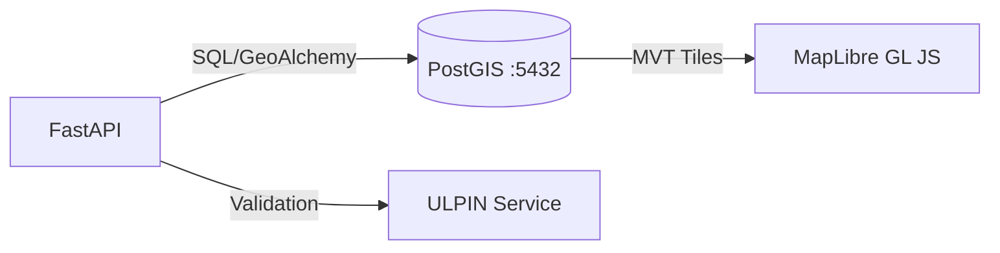

# Spatial & Geo Architecture

## 1. Scope & Responsibility
Geospatial Queries, Tile Serving, and Geometry Validation using PostGIS.
*   **Role**: Manage Parcel Boundaries (Vector) and Maps.
*   **Coordinate System**: WGS84 (EPSG:4326).

## 2. Architecture: Geo-Stack


## 3. Logical Functions & Data
### 3.1 Land Parcel Geometry (Table Schema)
Table `land_parcels`:
- `id` (UUID): Primary Key
- `khasra_number` (String): Indexed
- `geom` (Geometry): `MULTIPOLYGON`, SRID 4326, Spatial Index (GIST)
- `owner_id` (UUID): FK to Farmers

### 3.2 GeoJSON Response
Output from `/api/v1/parcels/geojson`:
```json
{
  "type": "FeatureCollection",
  "features": [
    {
      "type": "Feature",
      "geometry": {
        "type": "Polygon",
        "coordinates": [[[75.1, 32.2], [75.2, 32.2], [75.2, 32.3], [75.1, 32.2]]]
      },
      "properties": {
        "id": "uuid",
        "khasra": "101",
        "area_acres": 2.5,
        "status": "Active"
      }
    }
  ]
}
```

### 3.3 Spatial Operations
*   **Containment**: Check if Point in Parcel (`ST_Contains`).
*   **Overlap**: Detect disputed boundaries (`ST_Overlaps`).
*   **Validation**: Ensure closed rings and valid topology (`ST_IsValid`).

## 4. Endpoints & Ports
*   **Port**: `5432` (DB), `8000` (API)
*   **Endpoints**:
    *   `GET /api/v1/parcels/search?lat=...&lng=...`
    *   `POST /api/v1/spatial/validate`

## 5. Code Locations
*   **Model**: `backend/app/models/land_parcel.py`
*   **Logic**: `backend/app/api/v1/spatial_analysis.py`
