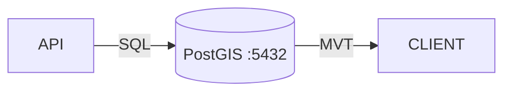

# Spatial & Geo Architecture

## 1. Scope & Responsibility
Geospatial Queries, Tile Serving, and Geometry Validation.

## 2. Architecture: PostGIS Core (As-Is)

## 3. Endpoints & Ports
*   **Port**: `5432` (DB)
*   **Endpoints**:
    *   `GET /parcels/geojson`
    *   `GET /spatial/analyze`

## 4. Credentials (Dev)
*   **DB User**: `postgres`
*   **DB Password**: `password`
*   **DB Name**: `land_records`

## 5. Code & Scripts
*   **Code**: `backend/app/api/v1/geo.py`
*   **Script**: `test-geo.sh`
