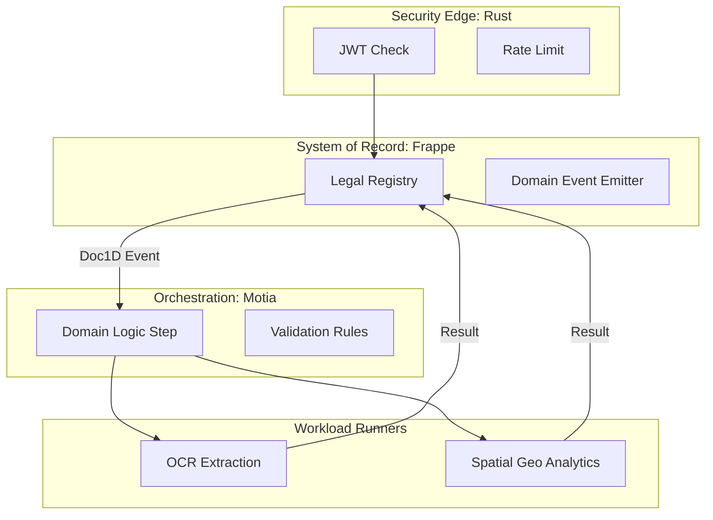

# 📚 AgriStack Verified System (Consolidated Documentation)
**Date**: December 22, 2025  
**Version**: 5.5 (Motia-Unified Thinkable Architecture)

---

## 🏗️ 1. Master "Thinkable" Architecture
The system follows a **Unified Backend** model where domain logic is abstracted into **Motia Steps**. This ensures that complex flows remain logical and manageable.

### 1.1 The Lifecycle of a "Document 1D"
The **Document 1D** is the central "Thinkable" object. Its journey defines the platform's execution:
1.  **Ingress**: Created in the `Registry_Step` (Frappe).
2.  **Activation**: Emitted as a `Domain Event`.
3.  **Refinement**: Processed by one or more `Service_Steps` (OCR/GIS) via `Logic_Step` orchestration.
4.  **Finalization**: Async results are merged back into the legal registry, closing the loop.

---

## 🧩 2. Consolidated "Step" Modules

### A. Core Polyglot Layers
| Step Category | Primitive | Technology | Functional Role |
| :--- | :--- | :--- | :--- |
| **Edge** | `Edge_Step` | Rust Shield | Intercepts all ingress for security validation. |
| **Logic** | `Core_Step` | Motia / Python | Decides which workers to invoke based on Document 1D type. |
| **Registry** | `SOR_Step` | Frappe | Maintains the authoritative state of land parcels. |
| **Worker** | `Service_Step` | FastAPI / AI | Performs stateless, CPU-intensive data transformations. |

### B. Functional Specifications
1.  **Logical Mapping**: Every API endpoint (defined in `backend/app/main.py`) acts as a functional trigger for an underlying Step.
2.  **State Management**: Unified across all runtimes using Redis and Document 1D markers.

---

## ☁️ 3. Deployment Topology (Thinkable View)

| Service | Motia Role | Port | Connection Logic |
| :--- | :--- | :--- | :--- |
| **Rust Gateway** | `Edge_Proxy` | 8090 | Upstream to erp-web |
| **Frappe (erp-web)** | `SOR_Registry` | 8000 | Downstream to Motia |
| **Motia Backend** | `Flow_Manager` | 8000 | Orchestrates Workers |
| **PostgreSQL** | `Spatial_Store` | 5432 | Shared Context |

---

## ✅ System Integrity Status (Dec 22, 2025)

*   **Architecture Model**: ADMD v2.0 (Motia-Unified).
*   **Logical Traceability**: Document 1D consistency established across Rust/Python/Frappe.
*   **Functional Alignment**: All services refactored as stateless Steps.
*   **Thinkable UX**: Lifecycle-based documentation for multi-dev clarity.
