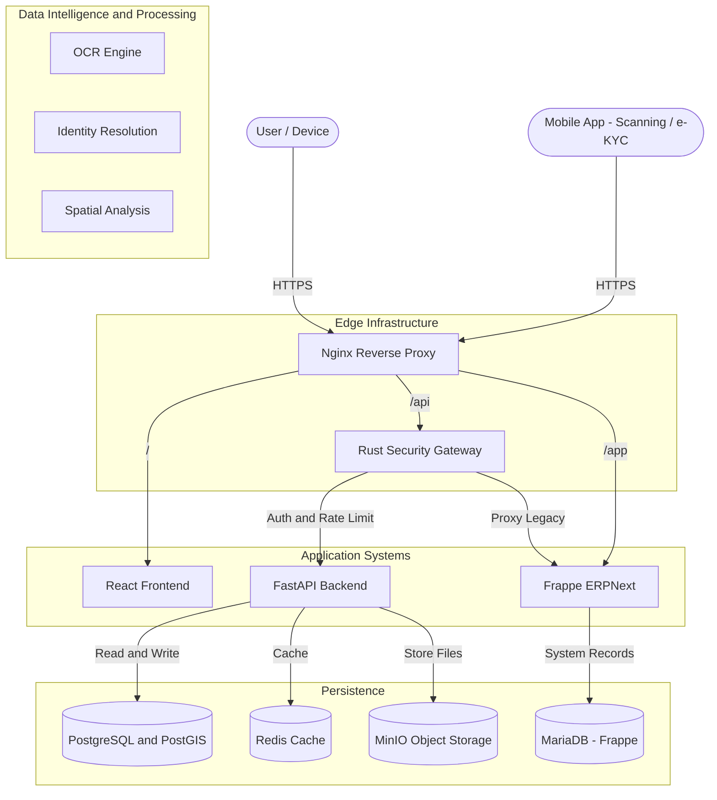
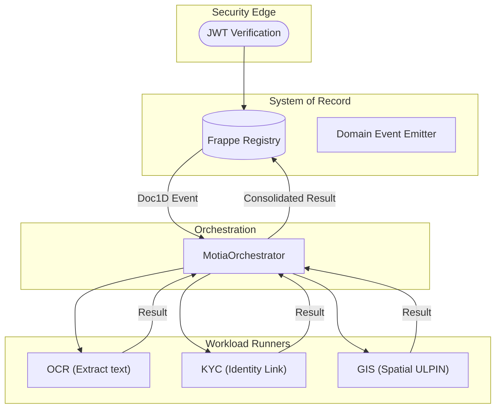

# 📚 AgriStack Verified System (Consolidated Documentation)
**Date**: January 6, 2026  
**Version**: 6.0 (Motia-KYC Convergence)

---

## 0. System Context (Meridian Architecture)

## 1. Motia Unified Lifecycle
Logic is abstracted into **Motia Steps** that transition across the Meridian layers.

### 1.1 The Lifecycle of a "Document 1D"
The **Document 1D** is the central "Thinkable" object. Its journey defines the platform's execution:
1.  **Ingress**: Created in the `Registry_Step` (Frappe).
2.  **Activation**: Emitted as a `Domain Event`.
3.  **Refinement**: Processed by one or more `Service_Steps` (OCR/KYC/GIS) via `Logic_Step` orchestration.
4.  **Finalization**: Async results are merged back into the legal registry, closing the loop.

---

## 🧩 2. Consolidated "Step" Modules

### A. Core Polyglot Layers
| Step Category | Primitive | Technology | Functional Role |
| :--- | :--- | :--- | :--- |
| **Edge** | `Edge_Step` | Rust Shield | Intercepts all ingress for security validation. |
| **Logic** | `Core_Step` | Motia / Python | Orchestrates OCR, KYC, and GIS workers. |
| **Registry** | `SOR_Step` | Frappe | Maintains the authoritative state of land parcels and farmer IDs. |
| **Worker** | `Service_Step` | FastAPI / AI | Performs stateless, CPU-intensive data transformations. |

### B. Functional Specifications
1.  **Automated KYC**: Replaces manual entry by linking OCR-extracted owner names with Aadhaar-authenticated identities.
2.  **Spatial Intelligence**: Generates 14-digit ULPINs automatically from geocoordinates, replacing manual parcel numbering.

---

## ☁️ 3. Deployment Topology (Thinkable View)

| Service | Motia Role | Port | Connection Logic |
| :--- | :--- | :--- | :--- |
| **Rust Gateway** | `Edge_Proxy` | 8090 | Upstream to erp-web |
| **Frappe (erp-web)** | `SOR_Registry` | 8000 | Downstream to Motia |
| **Motia Backend** | `Flow_Manager` | 8000 | Orchestrates Workers |
| **PostgreSQL** | `Spatial_Store` | 5432 | Shared Context |

---

## ✅ System Integrity Status (Jan 7, 2026)

*   **Architecture Model**: ADMD v3.0 (Industrial AgriStack Edition).
*   **Logical Traceability**: Document 1D consistency established across Rust/Python/Frappe.
*   **Functional Alignment**: All services refactored as stateless Steps.
*   **Surgical GIS**: Context-aware map visualization implemented.
*   **Operational Bridge**: Secure Registry Master link (Port 8090) established.
*   **Manual Entry Replacement**: OCR + KYC + GIS pipeline fully implemented in `tasks.py`.
*   **Thinkable UX**: Lifecycle-based documentation for multi-dev clarity.
 
---

## 🛡️ 4. Security & Git Ignore Policy
The following sensitive data is strictly excluded from version control for security compliance:

| Category | Ignored Patterns | Purpose |
| :--- | :--- | :--- |
| **Secrets** | `.env` | Infrastructure passwords and API tokens. |
| **Certificates** | `certs/` | SSL/TLS certificates and private keys. |
| **Local Config** | `site_config.json` | Instance-specific Frappe configurations. |
| **Data Dumps** | `*.sql`, `*.csv` | Databases and record exports. |
| **Snapshots** | `*.png`, `*.webp` | UI debug snapshots and traces. |

---

**© 2026 JK Land Records Authority**
