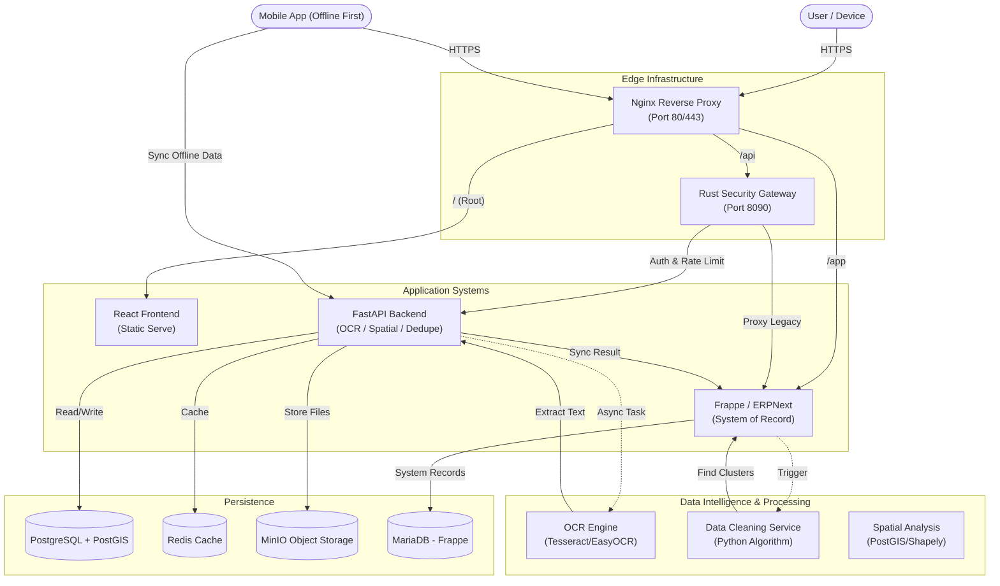

# 📚 AgriStack Verified System (Consolidated Documentation)
**Date**: December 14, 2025  
**Version**: 3.1 (Combined Architecture & Analysis)

---

## 🏗️ 1. Master System Architecture ("Meridian" Flow)

This diagram represents the certified traffic flow from external users to internal systems, highlighting the Role of the Rust Gateway, the Split-Stack backend (FastAPI + Frappe), and the Data Intelligence layer.

---

## 🧩 2. Core Modules & Code Implementation

### A. Frappe: The System of Record (`land_records` App)

**Role**: Central authority for Land Parcels, Farmers, and Workflow State.

#### 1. Key DocTypes
*   **Land Parcel** (`land_parcel.json`): Stores geospatial boundary (`geojson`), ownership status, and physical attributes.
    *   *Code Connection*: Frontend `MapView.tsx` fetches this directly via `frappeDataApi.getList('Land Parcel')`.
*   **Farmer** (`farmer.json`): Linked to Parcels via `Farmer Parcel Link`.
    *   *Logic*: Includes **Name Match Score (NMS)** verification logic (80-100 Auto-Approve, 31-79 Manual).
*   **OCR Result** (`ocr_result.json`):
    *   *Purpose*: The "Logic Queue" Entry Point.
    *   *Code Connection*: Mobile (`ocr.ts`) and Web (`client.ts`) create this Doc to trigger processing.
    *   *Logic*: `OCRResult` controller calls `RoRParser`.

#### 2. Logic Controllers
*   **RoR Parser** (`ror_parser.py`):
    *   *Feature*: Extracts Urdu/English text from OCR raw data.
    *   *Code*: Handles "Walad/Pisaran" parentage, splits multi-Khasra rows into individual records.
*   **Data Cleaning** (`data_cleaning.py`):
    *   *Feature*: Deduplicates Farmers against PMKISAN/PMFBY schemes.
    *   *Key Logic*: Normalization (Prefix removal), Fuzzy Matching (SequenceMatcher), BFS Clustering.
    *   *Endpoint*: `/api/method/land_records.lr_core.utils.data_cleaning.run_deduplication_pipeline`.

---

### B. Rust Security Gateway (`rust-shield`)

**Role**: Unified Ingress & Security Policy Enforcement.

*   **Port**: `8090`
*   **Routing Logic** (`main.rs`):
    *   `/api/v1/*` → Backend (FastAPI)
    *   `/api/*` → Frappe (ERPNext)
    *   `/app/*` → Frappe (UI)
*   **Middleware**:
    *   **Auth**: Validates JWT/Session.
    *   **RateLimit**: Governor-based token bucket.
    *   **Audit**: Logs all access to `AuditLog`.

---

### C. FastAPI Backend Bridge (`backend`)

**Role**: Heavy Lifting, OCR Processing, Legacy Sync.

*   **Sync Service** (`sync_service.py`):
    *   *Bi-directional Sync*: Listens to Frappe Webhooks or polls DB to ensure PostgreSQL (PostGIS) matches MariaDB.
*   **OCR Engine** (`girdawari_extractor.py`):
    *   *Function*: Uses Tesseract/Vision API to convert Images to Text.
    *   *Flow*: Triggered when `OCR Result` is created in Frappe.

---

## 💻 3. Frontend Ecosystem

### A. Web Portal (`frontend-landing`)

**Role**: Officer Dashboard for Review and Registry Management.

#### 1. Map View Logic (`MapView.tsx`)
*   **Refined Logic**: Parcels are **hidden by default**. Visual clutter is reduced.
*   **Search**: Searching for ULPIN/Owner triggers:
    1.  `parcelApi.search(query)`
    2.  Selects result.
    3.  **Pins** property on map and reveals polygon.
*   **Data Source**: Directly fetches GeoJSON from Frappe (`frappeDataApi.getList`).

#### 2. OCR Upload (`client.ts`)
*   **Flow**:
    1.  User uploads Girdawari Image.
    2.  `ocrApi.upload` calls Frappe `upload_file`.
    3.  Creates `OCR Result` with status `Processing`.
    4.  Logic Queue takes over.

### B. Native Mobile App (`mobile`)

**Role**: Field Agent Tool (Offline First).

#### 1. OCR Integration (`ocr.ts`)
*   **Unified Flow**: Like the Web, the Mobile App creates `OCR Result` docs in Frappe.
*   **Endpoint**: Uses `frappeClient` pointing to Gateway `/api`.
*   **Benefit**: Field data instantly enters the standard review queue visible to Officers.

---

## ☁️ 4. Deployment & Orchestration

### Production Orchestration (`docker-compose.prod.yml`)
*   **Nginx Edge**: Single entry point terminating SSL.
*   **Static Frontend**: Built into Nginx container (No Node.js runtime in prod).
*   **No-Reload Backend**: Runs `uvicorn` directly for stability.

### Hosting Architecture Options

| Feature | **Option A (Hybrid)** | **Option B (Docker)** | **Option C (Cloud)** |
| :--- | :--- | :--- | :--- |
| **Backend Code** | Run on Host | Run in Container | Remote Server |
| **Databases** | Docker | Docker | AWS RDS / Managed |
| **Gateway** | Docker | Docker | Docker / K8s |
| **Ideal For** | Active Dev | Local Testing | Production |
| **Config** | `BACKEND_URL=host.docker.internal` | `COMPOSE_PROFILES=backend` | `BACKEND_URL=https://api...` |

### Environment Variables (`docker-compose.yml`)

 | Service | Variable | Value | Purpose |
 | :--- | :--- | :--- | :--- |
 | **Frontend** | `VITE_API_TARGET` | `http://jk-security-gateway:8090` | Routes API via Gateway |
 | **Rust Gateway** | `FRAPPE_URL` | `http://erp-web:8000` | Upstream Frappe |
 | **Rust Gateway** | `BACKEND_URL` | `http://backend:8000` | Upstream FastAPI |
 | **Mobile** | `client.ts` | `http://10.0.2.2:8090` | Android Emulator Access |

---

## ✅ Status Summary

*   **Cross-System Sync**: Active. Updates in Frappe reflect in Maps.
*   **Map Experience**: Optimized (Search-only).
*   **Security**: All traffic routed via Rust Gateway.
*   **Logic Reuse**: Mobile and Web use the same logic queues in Frappe.
*   **Data Intelligence**: Deduplication pipeline active for cleaning records.
