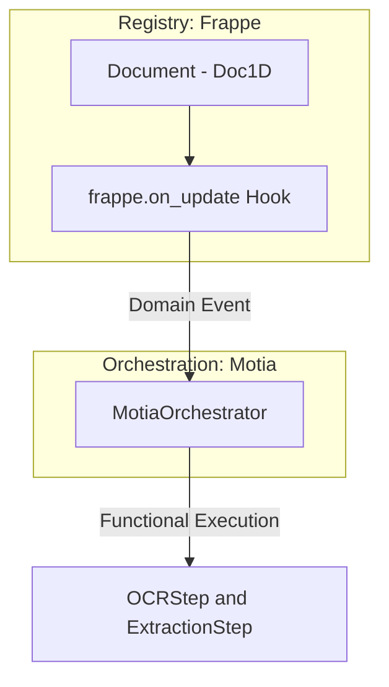

# Frappe Integration Architecture (Registry_Step)

## 1. Role: The authoritative "Registry_Step"
In the **Motia Unified Architecture**, Frappe (ERPNext) serves as the **System of Record (SOR)**. It is the primary data source and the persistence layer for all legal land records.

*   **Primitive**: `Registry_Step`
*   **Version**: Frappe v15 / ERPNext v15
*   **Identification**: Anchored by **Document 1D**.

## 2. Event-Driven Handoff to Motia
The Registry Step emits **Domain Events** consumed by the `MotiaOrchestrator`.



### 3.0 Core Identification (Document 1D)
Every record created within the Registry Step must have a unique **Document 1D**. 
*   **Generation**: Assigned during initial ingress.
*   **Orchestration**: Used by **Motia** to track asynchronous tasks across different languages and services.

### 3.1 Primary Registry Doctypes
These are the core entities managed as part of the `Registry_Step`.

| Doctype Name | Functional Role | API Resource ID |
| :--- | :--- | :--- |
| **Land Parcel** | Parcel Master | `Land Parcel` |
| **ULPIN Record** | Spatial ID | `ULPIN` |
| **ROR Document** | Legal History | `ROR Report` |
| **Farmer Registry** | Identity | `Farmer` |

## 4. Logical Interface: Webhooks & API
The `Registry_Step` interacts with other Steps via standardized interfaces.

### 4.1 Inbound Sync (Step -> Registry)
Specialized Service Steps post results back to Frappe using the **Document 1D** as the lookup key.
*   **Endpoint**: `/api/v1/frappe/webhook` (Defined in `backend/app/api/v1/frappe_sync.py`)

### 4.2 Outbound Events (Registry -> Step)
When a document is updated in Frappe, it triggers an outbound notification:
*   **Sync Logic**: Webhooks configured on `on_update` or `on_submit` events point to the **Motia Orchestrator**.

## 5. Functional Implementation Reference

```python
# backend/app/services/frappe_sync/sync_service.py
class FrappeSyncService:
    """Logical Step for reconciling external results into the Registry"""
    
    def sync_record(self, doc_id: str, results: Dict[str, Any]):
        # Reconcile result based on Document 1D (doc_id)
        # 1. Fetch metadata context
        # 2. Update Registry record
        # 3. Trigger Real-time UI refresh
```

---

## 6. Maintenance & Status
The **Registry_Step** is fully operational. All new development must ensure that domain events emitted from Frappe carry the mandatory **Document 1D** payload for Motia consistency.
