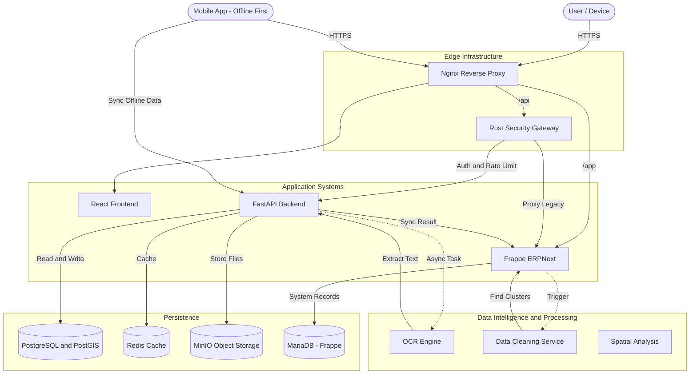
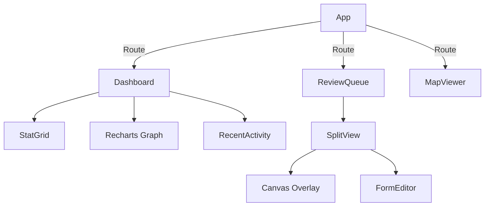

# Frontend Architecture (Web)

## 0. System Context (Meridian Architecture)


## 1. Scope & Responsibility
React-based Dashboard for Verifiers and Operators.
*   **Role**: UI for Review, Geo-Visualization, and Analytics.
*   **Tech Stack**: Vite + React + Tailwind + Recharts + MapLibre.

## 2. Architecture: Component Tree


## 3. Logical Functions & State
### 3.1 Dashboard (`Dashboard.tsx`)
*   **Stats Fetching**: Aggregates data from `parcelApi.getStats()` and `reviewApi.getPending()`.
*   **Visualization**: Renders real-time sync activity using SVG paths (Waveform).
*   **Recent Updates**: Polling list of recent Parcel modifications.

### 3.2 Review Logic (`ReviewDashboard.tsx`)
*   **Input**: JSON List of `ReviewTask` (Pending).
*   **Action**: User approves/edits -> `PATCH /api/v1/reviews/{id}`.
*   **Output**: Updates Status -> 'Approved' -> Triggers DB Sync.

## 4. Endpoints & Ports
*   **Port**: `5173` (Development)
*   **Target API**: `http://localhost:8090` (Security Gateway) or `8000` (Direct).

### 4.1 Developer API Reference (Key Integrations)
These endpoints are actively consumed by the frontend client. Use these to debug network tabs.

| Feature | Method | Endpoint | Purpose |
| :--- | :--- | :--- | :--- |
| **Dashboard** | `GET` | `/api/v1/parcels/stats` | Fetches aggregate counters (Total, Pending, disputes) |
| **Registry Master** | `LINK` | `8090/app/land-parcel`| Unified Secure Link to Frappe SOR Registry |
| **Review** | `GET` | `/api/v1/reviews/pending` | Loads the live OCR verification queue |
| **Review** | `POST` | `/api/v1/reviews/{id}/approve`| Live Approve & Transmit to AgriStack |
| **Map** | `SURGICAL` | `MapView.tsx` | Context outlines + status-based target fill |

## 5. Directory Structure
```
frontend-landing/src/
├── components/
│   ├── Dashboard.tsx       # Main Stats View
│   ├── ReviewQueue.tsx     # Review UI
│   ├── MapView.tsx         # GIS Layer
├── api/
│   ├── client.ts           # Axios Instance
└── constants/
    └── translations.ts     # Localization
```
