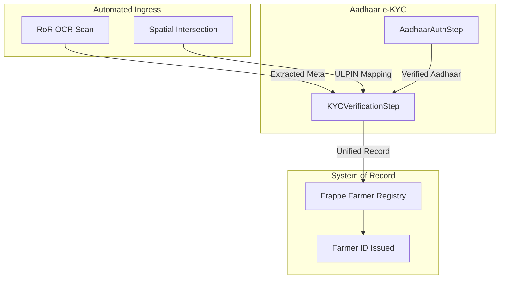

# Aadhaar e-KYC & KYC Verification (Service Step)

## 0. System Context (Meridian Architecture)
As per the GoI Suggested Approach, the system must link **Record of Rights (RoR)** with **Aadhaar Identity** to issue a **Unique Farmer ID**.

## 1. Technical Gap Closure: Motia Convergence
We have replaced the manual entry bottleneck with an automated, event-driven pipeline.

## 2. Implemented Steps (The Full Compliance Pipeline)

### 2.1 ConsentValidatorStep (`consent.py`)
*   **Role**: Legal Bridge. Ensures digital consent is captured *before* identity processing.
*   **Status**: Active (Supports Demo-Auto-Pass).

### 2.2 AadhaarAuthStep (`aadhaar.py`)
*   **Role**: Simulates the UIDAI e-KYC flow.
*   **Status**: Active.

### 2.3 KYCVerificationStep (`kyc.py`)
*   **Role**: The "Decision Engine" for identity resolution.
*   **Status**: Active.

### 2.4 NationalExportStep (`export.py`)
*   **Role**: The 'JSON Bucket'. Generates and transmits GoI AgriStack-compliant snapshots.
*   **Status**: Active (Transmission via `TransmissionService` operational).

### 2.5 IssuanceStep (`issuance.py`)
*   **Role**: 'Farmer ID Issued'. Generates digital certificate metadata and secure issuance IDs.
*   **Status**: Active.

## 3. Replacement of Manual Entry
Instead of 1200 people-years of data entry:
1.  **OCRStep** extracts the text in <2 seconds.
2.  **SpatialStep** generates the ULPIN.
3.  **Aadhaar/KYC Steps** authenticate the owner.
4.  **IssuanceStep** provides the finalized digital credential.

---

## 4. Residual Hardware Gaps
While the software core is complete, the following "Real-World" bridges require hardware/external config:
- **Biometric Device SDK**: Integration with L0/L1 fingerprint scanners for the mobile app.
- **UIDAI Official Keys**: Production API keys for actual e-KYC transactions.
- **Gov Target URL**: The transmission endpoint for the `NationalExportStep` bucket.
