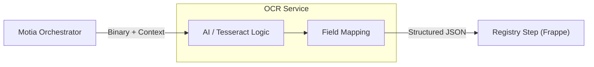

# OCR & Document Intelligence (Service Step)

## 1. Role: The data-extractive "Service_Step"
The **OCR Engine** is a specialized, stateless **Service Step** designed to convert unstructured land documents (PDFs/Images) into verified digital state. It is invoked purely as a functional runner by the **Motia Orchestrator**.

*   **Primitive**: `Service_Step`
*   **Input**: Document 1D + Binary Stream.
*   **Logic**: Multilingual OCR (Urdu/English) + Entity Parsing.

## 2. Functional Workflow
The Step follows a strict logical pipeline to ensure "Thinkable" data extraction.

### 2.1 Extraction Pipeline
1.  **Image Prep**: Normalization and noise reduction.
2.  **Multilingual Deciphering**: Concurrent processing for Urdu and English scripts.
3.  **Schema Alignment**: Mapping text blocks to the `Land Parcel` or `ROR` schema using **Document 1D** as the anchor.

## 3. Logical Architecture: Motia Integration

## 4. Multi-Dev Consistency
By isolating the OCR logic as a stateless `Service_Step`, we allow the AI team to iterate on models (Python/PyTorch) without affecting the API security (Rust) or the Legal Registry (Frappe).

### 5. Implementation Reference
*   **API**: `backend/app/api/ocr.py`
*   **Extraction Logic**: `backend/app/services/extraction/`
*   **Status**: Supporting hybrid Urdu-English extraction for Girdawari and Jamabandi reports.

---

## 6. Functional Compliance
All results emitted from the **OCR_Step** must be asynchronous and must carry the **Document 1D** to allow the `Registry_Step` to perform precise reconciliation.
