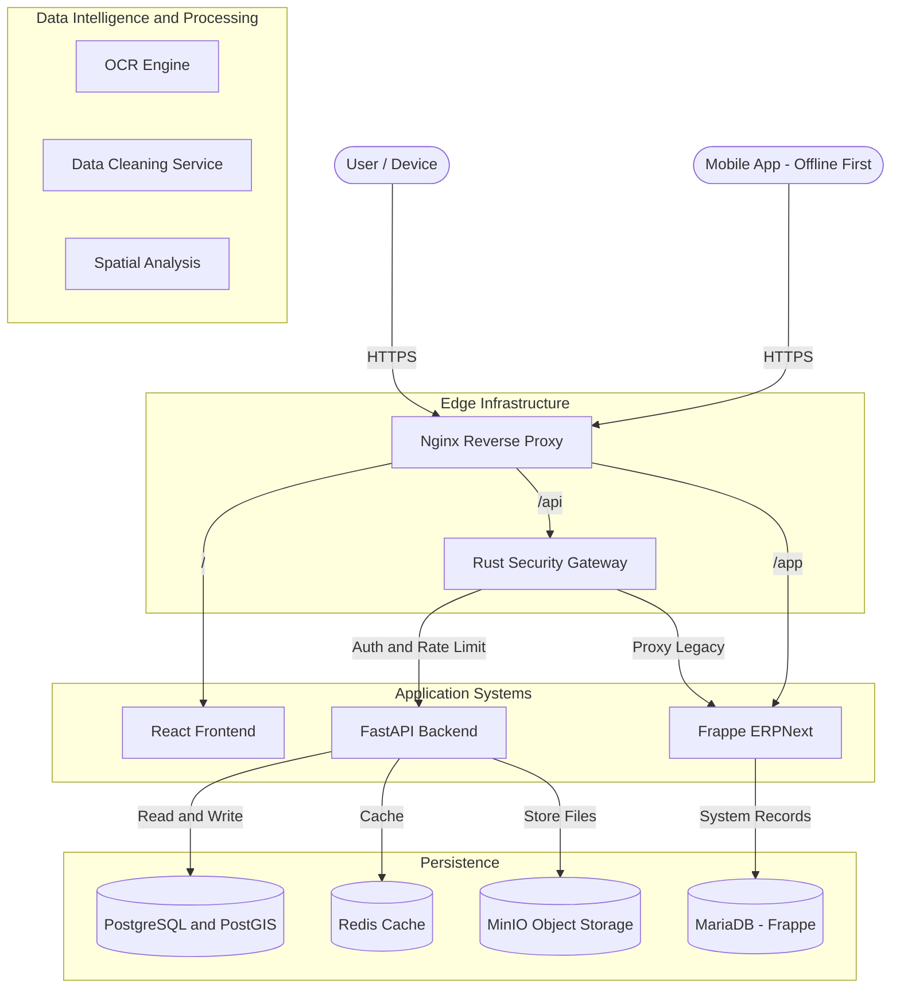
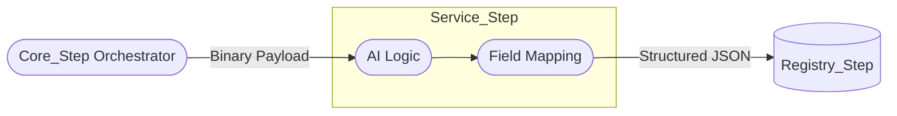

# OCR & Document Intelligence (Service Step)

## 0. System Context (Meridian Architecture)

## 1. Role: The data-extractive "Service_Step"
OCR is a specialized **Service_Step** invoked by the `MotiaOrchestrator`.

## 3. Logical Architecture: Motia Integration

## 4. Multi-Dev Consistency
By isolating the OCR logic as a stateless `Service_Step`, we allow the AI team to iterate on models (Python/PyTorch) without affecting the API security (Rust) or the Legal Registry (Frappe).

### 5. Implementation Reference
*   **API**: `backend/app/api/ocr.py`
*   **Extraction Logic**: `backend/app/services/extraction/`
*   **Status**: Supporting hybrid Urdu-English extraction for Girdawari and Jamabandi reports.

---

## 6. Functional Compliance
All results emitted from the **OCR_Step** must be asynchronous and must carry the **Document 1D** to allow the `Registry_Step` to perform precise reconciliation.
