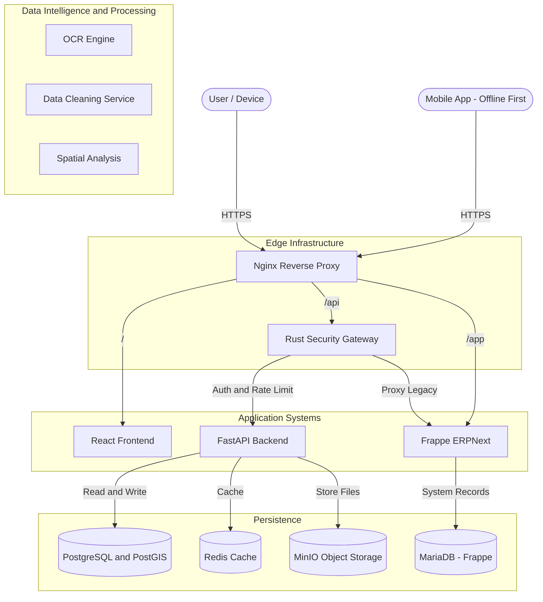
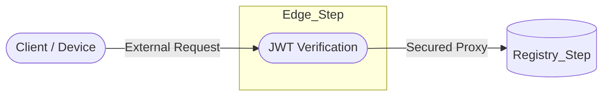

# Rust Security Gateway (Edge Step)

## 0. System Context (Meridian Architecture)

## 1. Role: The performance-critical "Edge_Step"
Following **Motia Principles**, the gateway acts as a stateless **Edge_Step**.

## 3. Logical Architecture: Proxy Flow

## 4. Maintenance & Multi-Dev Alignment
As a polyglot component, the **Edge_Step** ensures that even if downstream services (Python/JS) have varied security footprints, the "Edge" remains consistently hardened.

### 5. Implementation Status
*   **Core**: `rust-shield/src/main.rs`
*   **Middleware**: `rust-shield/src/middleware/`
*   **Status**: Operational with JWT and Session handling.

---

## 6. Development Rule
Any new API exposed via the `Registry_Step` or `Core_Step` must be mirrored in the **Edge_Step** whitelist to ensure the "Security Step" remains the unified gatekeeper.
