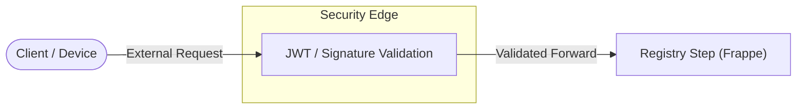

# Rust Security Gateway (Edge Step)

## 1. Role: The performance-critical "Edge_Step"
The **Rust Security Gateway** is the first point of contact for all external requests. Following **Motia Principles**, it acts as a stateless **Edge Step** that validates, secures, and forwards traffic to the downstream Registry.

*   **Primitive**: `Edge_Step`
*   **Language**: Rust (Actix-web)
*   **Performance**: Sub-millisecond overhead for high-concurrency validation.

## 2. Functional Guardrails
The Edge Step provides three primary functional layers:

### 2.1 Identity Validation (JWT)
*   **Logic**: Intercepts `Authorization` headers.
*   **Process**: Decodes JWT against Keycloak public keys.
*   **Thinkable Outcome**: Only authenticated "Steps" can reach the legal registry.

### 2.2 Integrity Verification (Signature)
*   **Logic**: Validates payload hashes for cross-service events.
*   **Process**: Ensures `Document 1D` data has not been tampered with during transit.

### 2.3 Rate Limiting & DoS Protection
*   **Logic**: Dynamic window-based limiting using Redis.
*   **Config**: Defined in `rust-shield/src/middleware/rate_limit.rs`.

## 3. Logical Architecture: Proxy Flow

## 4. Maintenance & Multi-Dev Alignment
As a polyglot component, the **Edge_Step** ensures that even if downstream services (Python/JS) have varied security footprints, the "Edge" remains consistently hardened.

### 5. Implementation Status
*   **Core**: `rust-shield/src/main.rs`
*   **Middleware**: `rust-shield/src/middleware/`
*   **Status**: Operational with JWT and Session handling.

---

## 6. Development Rule
Any new API exposed via the `Registry_Step` or `Core_Step` must be mirrored in the **Edge_Step** whitelist to ensure the "Security Step" remains the unified gatekeeper.
