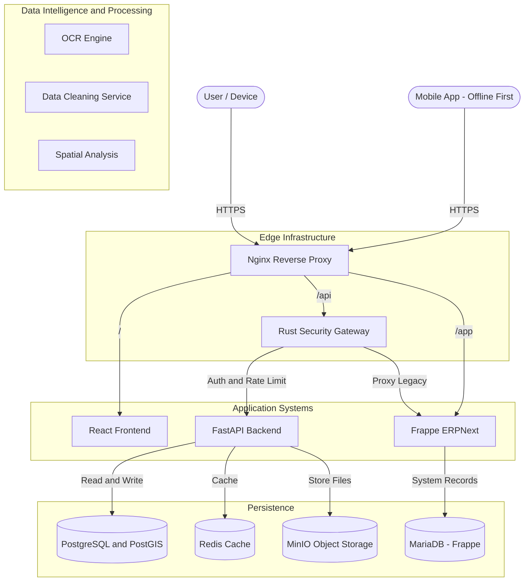
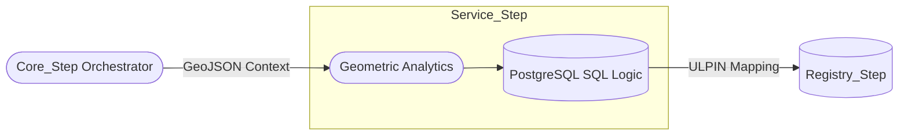

# Spatial Intelligence & GIS (Service Step)

## 0. System Context (Meridian Architecture)

## 1. Role: The geometric "Service_Step"
Spatial Intelligence is a specialized **Service_Step** responding to geometric triggers.

## 2. Logical Execution Flow
The Spatial Step is strictly functional, responding to geometric triggers from the **Motia** layer.

### 2.1 Spatial Analytics Process
1.  **Coordinate Mapping**: Translating local Khasra sketches into global lat/long coordinates.
2.  **ULPIN Generation**: Calculating the centroid of a geometry to create the Unique Land Parcel Identification Number.
3.  **Conflict Detection**: Running intersection queries to identify overlapping claims (Disputes).

## 3. Logical Architecture: Motia Integration

## 4. Thinkable Mapping
By treating Geo-data as a "Thinkable Step", we move away from complex SQL management to a functional API. 
*   **Input**: `Document 1D` + `Geometry`
*   **Output**: `Validated Status` + `Spatial Index`

### 5. Implementation Reference
*   **Models**: `backend/app/models/land_parcel.py` (GeoAlchemy2)
*   **Analysis**: `backend/app/api/v1/spatial_analysis.py`
*   **Status**: Supporting Khasra-level indexing and dispute visualization.

---

## 6. Functional Integrity
All spatial calculations are idempotent. Every geometric result returned to the `Registry_Step` must reference the authoritative **Document 1D** to ensure the legality of the geospatial record.
